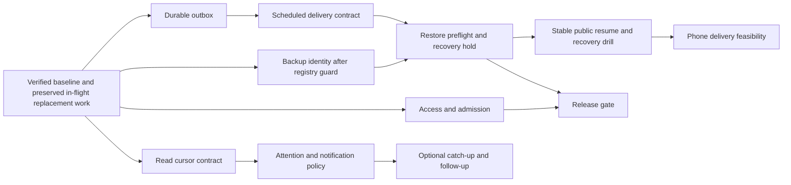

# Gatherline: current-code audit and execution plan

**Updated 29 September 2026 · verified product baseline: `c85132b` (merged through PR #124).** This plan is for Codex or Claude to implement in reviewable slices. The original 27 September audit inspected `8507275` plus ten in-flight files; those hosting changes have since merged. The current review below supersedes stale completion claims in the [remaining-work inventory](REMAINING-WORK-2026-09.md) and [improvement plan](IMPROVEMENT-PLAN-2026-09.md). The [September 24 roadmap](PRODUCT-ROADMAP-2026-09-24.md) still explains the product direction. The three companion audits retain dated source paths, reproductions, and acceptance cases: [client/UI](audits/2026-09-27-client-ui.md), [server/protocol/data](audits/2026-09-27-server.md), and [desktop/operations](audits/2026-09-27-desktop-ops.md). Their old line numbers are historical; current references below are against `c85132b`.

This is a source review with local tests and controlled reproductions, not participant research. The main checkout had no tracked product changes during this review. Separately, `.claude/worktrees/o04` on `feat/replace-from-backup` has six uncommitted product files adding backup listing/replacement. That work is not in this baseline and must not be marked shipped or copied over during another ticket. It does not yet establish the recovery hold required by D2.

## Verified update: Claude's September 29 work

| Merged work                                                                         | What is correctly implemented                                                                                                                                                                                                   | Completion boundary                                                                                                                                                                                                                 |
| ----------------------------------------------------------------------------------- | ------------------------------------------------------------------------------------------------------------------------------------------------------------------------------------------------------------------------------- | ----------------------------------------------------------------------------------------------------------------------------------------------------------------------------------------------------------------------------------- |
| [#121: start with the computer](https://github.com/Blazeiscoding/SlackOSS/pull/121) | Folder-based opt-in startup survives renames; ordinary registry/start failures are shown; resume/address changes request fresh mDNS announcements. Disabled mDNS, isolated mode and shutdown remain respected.                  | Local startup continuity is implemented. macOS hidden launch and failure recovery need R29-5–R29-7; this does not resume a public route or authorize restored work.                                                                 |
| [#122: backup worker](https://github.com/Blazeiscoding/SlackOSS/pull/122)           | Desktop backup, verification and restore run through a bundled worker thread, removing those SQLite calls from Electron's main thread. A reproducible measurement script and dated results exist.                               | Close the backup-worker subtask of D6. Keep S8 and broader capacity measurement open; R29-8 limits the benchmark's conclusions.                                                                                                     |
| [#123: connections and ports](https://github.com/Blazeiscoding/SlackOSS/pull/123)   | Count distinct authenticated users across sockets; first/last socket changes update the host UI/tray, and explicit revocation unregisters immediately. Port inputs validate and the running workspace's port cannot be changed. | O03's controls exist, but a saved explicit port loses its policy on later starts (R29-4). Count means connected authenticated sockets, not activity; idle session expiry can remain visible until the existing 30-second heartbeat. |
| [#124: scheduled backups](https://github.com/Blazeiscoding/SlackOSS/pull/124)       | Daily/weekly schedules, chosen destinations, retention counts, periodic checks and visible errors exist. The renderer chooses folders through the main-process dialog.                                                          | Scheduling is implemented, but retention can discard the new good copy (R29-1), destination freshness is wrong (R29-2), and due checks can overlap (R29-3). O01 is not a completed recovery guarantee.                              |

Do not reopen the already merged fixes S2, S3, S5, S7, CU-5, D1 or built-in-command admission. Conversely, **O04 is not fully closed for every advertised platform**, and moving backup work to a worker does not close all main-thread capacity risks.

### New findings and required fixes

Priorities use the same pre-pilot integrity/recovery gates as the ledger below. A controlled reproduction establishes the stated trigger, not its frequency in real installations.

**R29-1 · P0 · Retention can delete the freshly verified backup and keep an invalid one.** `apps/desktop/src/main/hosting.ts:918` admits retention candidates from their filename, existence of `manifest.json`, and database ID; it does not verify their manifest or files. It then sorts filename timestamps and deletes beyond `keep`. Reproduced with real `backupWorkspace`/`verifyBackup`: a same-workspace archive named with a future date and a corrupted `{}` manifest was rejected by verification, yet with `keep=1` the scheduler deleted the freshly created valid archive, kept only the invalid archive, advanced `lastBackupAt`, and reported no error. A bad clock or restored/copied archive can make filename order unreliable; no attacker is required. **Done when:** retention preserves the just-verified result, invalid/unverified candidates cannot satisfy the recovery-copy quota, and pruning cannot leave zero verified recoverable copies. Test corrupt manifests, missing files, future timestamps and clock rollback with real archives before any deletion.

**Fixed, 29 September (branch `fix/backup-retention-and-identity`): R29-1 and D3.** Retention now always keeps the copy just made, counts another copy towards `keep` only after the server's `verifyBackup` passes it, and never removes a failing copy while copies are still wanted. Backup requires the folder's database and the finished copy to hold the listed workspace's ID, removing a mismatched copy without recording it. Five regressions with real server-made archives cover a future-dated ruined manifest, missing and damaged archives, clock rollback, a folder holding another workspace and a swap during the copy; all five fail on `c75dbf7`. A copy whose database is unreadable cannot be shown to be this workspace's, so retention leaves it alone rather than delete it. Packaged Windows E2E was not run in this Linux environment.

**R29-2 · P1 · A new automatic-backup destination can remain empty for a full interval.** `hosting.ts:871` changes the schedule without destination-specific success state; `:954` bases every schedule on the workspace's global `lastBackupAt`. Reproduced: manually back up to folder A, enable weekly backups into empty folder B, run the due check, and B remains empty. Changing an existing schedule's destination has the same problem. This contradicts the documented immediate first backup. **Done when:** track successful automatic backup freshness per destination/schedule, make a new destination due immediately, and prevent a manual backup elsewhere from postponing its first copy. A failed first copy must remain due and visible.

**R29-3 · P2 · Overlapping due checks enqueue duplicate backups and can report a false failure.** `hosting.ts:940` reads due state outside the serialized backup operation. The immediate settings path (`index.ts:433`) and periodic checks (`:819`) can overlap. A controlled `Promise.all` of two due checks queued two copies; second-resolution output names collided and left an error after the first copy succeeded. **Done when:** allow one due pass or one in-flight scheduled backup per workspace, recheck current schedule/freshness inside that ownership boundary, and avoid filename collisions. Cover a tick overlapping settings changes, disabling a queued schedule, and two checks within one second.

**Fixed, 29 September (branch `fix/backup-schedule-freshness`): R29-2 and R29-3.** A schedule records `lastAt` for its own destination; a new or changed destination is due at once, a manual backup elsewhere no longer postpones it, and a failed first copy stays due and visible. One due pass runs at a time, a request during it runs once more after it, each workspace's schedule and freshness are re-read inside the turn that makes its copy, and a taken folder name moves on a second. Schedules saved before the fix have no `lastAt`, so each makes one backup at the first check after upgrading. Five of the six new regressions fail on the previous code; the failed-first-copy case also passed before and stays as a guard.

**R29-4 · P1 · A saved explicit port is silently replaced on a later collision.** `hosting.ts:619` reads the saved port, but `:637` permits port-zero fallback whenever the current request omits `port`. The existing-workspace Start button (`HostDialog.tsx:1448`) and automatic startup (`hosting.ts:1057`) pass only `{ folder }`; `:673` then persists the fallback. Reproduced after choosing 9100: bind attempts were `[9100, 0]`, the workspace ran on 54321, and 54321 replaced the saved port. A warning is shown, but the chosen-port promise and existing forwarding/links are broken. **Done when:** persist explicit-versus-automatic port intent; both manual reopening and auto-start refuse a chosen-port collision without overwriting the choice, while genuinely automatic ports retain fallback. Cover choices made at creation and through Change port.

**Fixed, 29 September (branch `fix/chosen-port-kept`): R29-4.** Each registry entry records `portChosen`. A port given at creation or through Change port is chosen; reopening from the list or starting with the app refuses a busy chosen port without trying another or saving one, and names the port and the workspace. A workspace on the usual port still moves to a free one with the existing warning. Entries saved before this count a port other than the usual one as chosen. Four new cases in `hosting.test.ts`: creation choice kept on reopening, Change port kept on auto-start (with `launchError`), automatic fallback unchanged, and an older entry's unusual port treated as chosen; the first, second and fourth fail on the previous code.

**R29-5 · P2 · macOS sign-in does not follow the promised hidden-launch path.** `index.ts:468` supplies login-item `args: ["--hidden"]` on Windows and macOS, while `:824` recognizes only that argument. Electron documents `args` as Windows-only and exposes `wasOpenedAtLogin` for macOS. This is a source/API-contract finding; no macOS runtime test was performed. **Done when:** use the supported platform launch signal, remain hidden only after hosting succeeds and a tray exists, and surface failures. Verify real installed macOS login and Windows registration; the packaged test explicitly injects `--hidden` and fakes OS registration. [Electron login settings](https://www.electronjs.org/docs/latest/api/app#appgetloginitemsettingsoptions), [registration options](https://www.electronjs.org/docs/latest/api/app#appsetloginitemsettingssettings).

**Fixed in source, 29 September (branch `fix/login-launch-per-platform`): R29-5.** A new `loginItem.ts` registers the `--hidden` argument only on Windows, and recognises a sign-in launch by that argument or, on macOS, by Electron's `wasOpenedAtLogin`. Turning on "Open Gatherline when you sign in" now reports a registration that did not take, including macOS holding it for approval in Login Items, instead of silently showing it on. The existing rule is unchanged: the window stays hidden only when hosting started and a tray exists. Unit tests cover both platforms' rules; no real macOS or Windows login was run, so the plan's verification on installed systems remains open.

**R29-6 · P2 · An unreadable startup preference silently becomes a cached empty choice.** `hosting.ts:396` reads `startOnLaunch` non-strictly, catches failures and caches `null`; `startForLaunch` returns before its error-reporting path. The settings store also suppresses non-strict read failures. A controlled read failure returned a stopped status with no `launchError`; repairing the file does not invalidate that cached result. **Done when:** distinguish absent/unselected from unreadable, retain actionable diagnostics, and permit retry after repair. Test failure reading the preference itself, not only a later registry failure.

**Fixed, 29 September (branch `fix/unreadable-launch-choice`): R29-6.** `readLaunchFolder` reads `startOnLaunch` strictly, treats a present value that is not a folder name as unreadable, and caches only a successful read. `startForLaunch` turns a failure into a `launchError` that says the choice could not be read and how to recover; the hosted list and forgetting a workspace still work without it, and reading again after the file is repaired finds the choice and starts it. Two new cases fail on the previous code; the existing "list could not be read" case now makes only the registry unreadable, as it describes.

**R29-7 · P2 · Startup settings cannot be disabled from the failed/stopped state.** Both checkboxes are inside `StartWithComputer`, rendered only while running (`HostDialog.tsx:1005`). A selected workspace with a present but unreadable/newer database cannot start; it cannot be forgotten either, because `hosting.ts:841` only permits forgetting a missing folder. **Done when:** expose clearing the selected workspace and disabling app login independently of a successful start, without deleting its registry entry. Cover a failed auto-start and an unreadable database.

**Fixed, 29 September (branch `fix/startup-choices-while-stopped`): R29-7.** The host dialog's stopped view shows a "When this computer starts" section whenever a workspace is chosen to start with Gatherline, a start failed, or Gatherline opens at sign-in. It offers "Don’t start <name> with Gatherline", "Start nothing when Gatherline opens" for a choice that could not be read, and the sign-in checkbox, none of which starts or removes the workspace. Clearing the choice also clears the launch error it caused. New cases: one in `hosting.test.ts` and three in `hostDialog.dom.test.tsx`, all failing on the previous code (the "shows nothing" case only because the old view never asked about sign-in).

**R29-8 · P2 · Performance documentation overstates the measurement envelope.** `scripts/measure-stall.mts:104` assigns each reply to channel index 4, while `:110` uses the preceding root from channel index 3; the synthetic threads therefore violate the production channel/root relationship. The script does not populate due/held schedules or exercise concurrent users. The recorded table itself includes 242 ms common-word search and 128 ms retention at 200,000 messages, so the inventory's claim that nothing else ordinary exceeded 100 ms is incorrect. **Done when:** seed valid same-channel threads, assert HTTP success and fixture invariants, measure due/held queue and concurrent workloads, and scope conclusions to machine/runtime/workload. Retain the measured backup improvement; choose process isolation from an explicit responsiveness budget instead of declaring it globally unnecessary.

### Older findings rechecked against the current code

| Finding                  | September 29 evidence and status                                                                                                                                                                                                                                                                                                                                                                                                                                                                  | Next acceptance gate                                                                                                                                                                                                         |
| ------------------------ | ------------------------------------------------------------------------------------------------------------------------------------------------------------------------------------------------------------------------------------------------------------------------------------------------------------------------------------------------------------------------------------------------------------------------------------------------------------------------------------------------- | ---------------------------------------------------------------------------------------------------------------------------------------------------------------------------------------------------------------------------- |
| D2 restore activation    | **Fixed 29 September** on `fix/restore-held-until-activated`: a restore sets a persisted `restoredHold`, drops the start-with-Gatherline choice, and returns the backup's inventory; a held workspace starts only isolated (server `isolated`, loopback only, no mDNS, no Open to all), start-with-app refuses it, and only an explicit `activate` start clears the hold.                                                                                                                         | The in-flight replacement UI (`feat/replace-from-backup`) must use the same hold when it lands; not verifiable from here.                                                                                                    |
| D3 backup identity       | **Still open; now reproduced with a real valid database.** A registry entry for workspace A whose folder holds B successfully backs up B and updates A's `lastBackupAt` (`hosting.ts:728`).                                                                                                                                                                                                                                                                                                       | Compare registry, source and verified snapshot IDs before reporting success or updating freshness; test swapped folders and identity changes during backup.                                                                  |
| S1 remaining admission   | **Fixed 29 September** on `fix/webhook-and-action-admission` (see note below the table). Webhooks have per-webhook and per-address budgets; commands, buttons and form submissions spend a per-account `appCall` budget and are capped in flight per account and per app.                                                                                                                                                                                                                         | A flooded webhook is refused without touching the app's other webhooks or people; guessed tokens spend the address budget; a fifth unanswered call from one account, or a seventeenth to one app, is refused and never sent. |
| S4 scheduled files       | **Fixed 29 September** on `fix/scheduled-sends-hold-their-files` (see note below the table). Schema v26 adds `scheduled_files`, keyed by file, written in the scheduling transaction.                                                                                                                                                                                                                                                                                                             | A held file refuses an ordinary send and a second schedule (409 `attachments_scheduled`), duplicates are refused, cancel releases, delivery releases, a failed row keeps its hold, and restart and upgrade keep it.          |
| S6 search dates          | **Fixed 29 September** on `fix/search-dates-by-calendar-day` (see note below the table). Days are read in the reader's IANA zone, carried as `tz`; bounds are found by calendar day, and a date that does not exist is refused by name.                                                                                                                                                                                                                                                           | `after:2026-03-08` in New York starts at 9 March 00:00 EDT and `after:2026-11-01` at 2 November 00:00 EST; 31 February and 29 February 2026 are refused; the result does not depend on the server's zone.                    |
| S8 schedule drain        | **Fixed 29 September** on `fix/scheduled-queue-bounded` (see note below the table). Admission is capped per account and per workspace; due rows drain ten per turn; held rows carry `next_attempt_at` (schema v27) and are woken when their obstacle clears.                                                                                                                                                                                                                                      | 2,000 due at once drain in about 3 s either way; the longest single hold of the loop fell from about 3 s to under 100 ms, median about 13 ms, on this machine.                                                               |
| CU-1 read state          | **Fixed 29 September** on `fix/thread-read-leaves-channel` (see note below the table). Reading a thread moves only that thread's cursor; replies no longer move the channel's newest seq unless also sent to the channel.                                                                                                                                                                                                                                                                         | Root seq 10 → unseen channel mention 11 → reply 12 now leaves the mention unread in store, client, Activity, the badge, after Back and after a reload.                                                                       |
| CU-2/CU-3 outbox         | **Fixed 29 September** on `fix/outbox-keeps-every-send` (see note below the table). A send past 50 waiting is refused before the composer lets go of it; a known refusal is persisted and waits for Retry.                                                                                                                                                                                                                                                                                        | Every accepted send survives a restart; an archived-channel or deleted-root refusal stays failed after a restart; an unknown outcome is still sent again under its nonce.                                                    |
| CU-4 scheduled broadcast | **Fixed 29 September** on the same branch. `alsoSendToChannel` is part of the scheduling request, its identity and the stored row (`broadcast`), and delivery posts with it.                                                                                                                                                                                                                                                                                                                      | A scheduled reply chosen for the channel appears in the channel; the Scheduled panel says which replies will.                                                                                                                |
| D4/D5 operator path      | **D4 guide corrected (#136); D5 implemented 29 September** on `feat/reopen-stable-address-on-launch`: an opt-in `reopenPublicOnLaunch` tied to one workspace and one stable address. After a start-with-Gatherline, it runs the normal Open to all, which verifies the address reaches this instance and defaults to invite-only. A changed address, a failed check or a held restore leaves network hosting running with a persistent `launchError`; temporary Quick Tunnels are never reopened. | Verify the real participant path from a second network after an OS-login restart (not possible from here).                                                                                                                   |

**Fixed, 29 September (branch `fix/thread-read-leaves-channel`): CU-1.** The contract: a reply belongs to its thread. Reading a thread moves only that thread's cursor, followed or not (an unfollowed thread keeps a cursor with `following = 0`, which the Threads list and count already ignore). A message is read when the channel's cursor or, for a reply, its thread's cursor has passed it; the store's Activity and mention queries, the client's `isMessageRead` and the Activity panel use that rule. A reply moves the channel's newest seq, and so its badge, only when it is also sent to the channel, on the server and in the live client. `ThreadPanel` no longer calls the channel's `markRead`, and reading a thread pushes fresh mention counts. Reading the channel past earlier replies still reads them, as before. Channels whose stored newest seq already counted a reply keep that value until the next message in the channel; there is no migration. Regressions: four server cases in `threads.test.ts`, three client cases in `unread.test.ts`, two UI cases in `threadRead.dom.test.tsx` and a phone-width browser scenario that opens the thread from the Threads list in another channel, goes Back and reloads. All but one fail on the previous code; the channel-read-past-replies case is a guard that also passed before.

**Fixed, 29 September (branch `fix/outbox-keeps-every-send`): CU-2 and CU-3.** `OUTBOX_LIMIT` (50) is now a bound on what one account can have waiting, checked in `WorkspaceClient.send()` before anything is taken: `send()` returns whether it accepted the message, and the composer keeps the words and says why when it did not. `outboxSnapshot()` and `restoreOutbox()` no longer slice, so nothing accepted is dropped, including a restored outbox larger than the bound. A failure the server answered with a 4xx (other than 401, 408 and 429) is a known refusal: it is persisted as `refusal` with the words the author saw, restored as failed, and sent again only by Retry. A lost connection, a lost acknowledgement or a 5xx is still an unknown outcome and is sent again after a restart under the same nonce. Stored outboxes from before the fix have no `refusal`, so a refused send already stored will be tried once more after upgrading. On the previous code 51 accepted sends persisted 50, dropping the oldest, and an archived-channel refusal was retried by itself after a restart.

**Fixed, 29 September (branch `fix/scheduled-sends-hold-their-files`): S4 and CU-4.** Schema v26 adds `scheduled_files (file_id PRIMARY KEY, scheduled_id)`, written in the same transaction as the scheduled row, and a `broadcast` column on `scheduled_messages`. Scheduling refuses duplicate file IDs (400 `invalid_attachments`) and files another scheduled message holds (409 `attachments_scheduled`). An ordinary send refuses a held file with the same 409, and `attachFiles` itself skips a file held by any schedule but the one being delivered. Delivery releases the hold in the message transaction; cancelling removes it with the row; a held or failed row keeps it so Retry still has its files; the abandoned-upload sweep also skips held files. The upgrade gives each outstanding row its files in queue order, so a file two rows named goes to the first; a row with unreadable `file_ids` claims nothing, and reads as having no files, as it did before. `alsoSendToChannel` is accepted by the scheduling route only for replies, joins the request hash only when true (so a request recorded before this still replays), is stored and returned as `broadcast`, and is passed to delivery. The composer sends it and clears the checkbox after scheduling, as it does after sending; the Scheduled panel labels replies. Eight of ten new server cases fail on the previous code; cancel and the sweep passed before and stay as guards. Any other branch adding a migration must now number it v27.

**Fixed, 29 September (branch `fix/webhook-and-action-admission`): the remaining S1 admission.** `Limits` gains `hook` (per webhook, burst 30 then 60 a minute), `hookByAddress` (per caller address, burst 120 then 240 a minute, charged before the token lookup) and `appCall` (per account, burst 20 then 60 a minute). Slash commands, block actions and view submissions pass through `admitAppCall` before anything is prepared for the call, so no bot join, trigger or response URL is created for a refused one. It refuses a fifth unanswered call from one account (429 `too_many_requests`) and a seventeenth to one app (429 `app_busy`) without queuing, and releases the slot however the call ends. `rateLimits: false` still turns all of it off. Built-in commands keep #120's post budget. Event deliveries already have their own per-subscription ordering and 500-item ceiling and were not changed. All six new cases fail on the previous code; three of them read the new constants, and the old code holds the extra calls open instead of refusing them.

**Fixed, 29 September (branch `fix/search-dates-by-calendar-day`): S6.** The contract: `before:D` and `after:D` name calendar days in the reader's IANA time zone, which the client sends as `tz` with every search. Without `tz` the server's own zone is used, which is what older clients got, and an unknown zone is refused (400 `invalid_time_zone`). As in Slack, `before:D` ends where D starts and `after:D` begins where the next day starts. Both instants are found by searching for the first moment of that calendar day in the zone, so a 23- or 25-hour day and a zone that skips midnight (Havana, Santiago) are handled. A value must round-trip as a real YYYY-MM-DD date; 31 February, 29 February in a common year, month 13 and years before 0100 are listed in `ParsedSearch.invalid`, and the server refuses the search naming them (400 `invalid_search_date`) instead of dropping the filter. The dialog now shows the named day in its chips (it used to show the day after for `after:`), marks unreadable dates as "not a date", shows the server's refusal, and labels the filter "After" rather than "On or after", which `after:` never meant. In a zone that falls back across midnight, the day's start is found but may be the second midnight; no current zone does this.

**Fixed, 29 September (branch `fix/scheduled-queue-bounded`): S8.** Scheduling refuses a request (409 `scheduled_limit`) once the account has 200 messages outstanding or the workspace 10,000; a replay of an accepted request still returns it. `dueScheduled` takes a limit, and `flushScheduled` handles one batch of ten, then continues on a later turn with `setImmediate` until the queue is empty, stopping on shutdown. A held row gets `next_attempt_at` (schema v27) a minute ahead instead of being re-checked every 15 seconds, and the store brings it forward when a channel is unarchived, a member added or an account reactivated; transient send failures back off the same way within the existing three attempts. The bounds are a server option, `scheduledLimits`. Measured with 2,000 rows due at once on this Linux container, draining took about 3 s at any batch size; the longest stall was about 3,000 ms unbatched, about 150 ms at fifty (median 64 ms) and 85 ms at ten (median 13 ms), which is why ten is the default. This is one machine and one run, and does not yet cover mixed workloads; R29-8's corrected benchmark is the place for that.

**Fixed, 29 September (branch `fix/stall-benchmark-valid`): R29-8.** `scripts/measure-stall.mts` now seeds each reply into a thread of its own channel, and stops before timing anything unless every message is seeded, no reply's root is in another channel or is itself a reply, and every HTTP request succeeds. It also found that the reader it describes had read nothing: since #118 a read cursor is held within the event log, which seeding bypasses, so the cursor is now placed directly and checked. It times twenty concurrent readers and the scheduled queue (2,000 due, 2,000 held and waiting, 2,000 held and due again) and prints the CPU, memory, Node version and platform. The worker-thread backup step now registers tsx inside the worker, which did not inherit the loader on Node 22 here. `docs/VALIDATION.md` keeps the earlier Windows numbers for the backup comparison, marked with the fixture flaws they had, adds a run of the corrected script at 50,000 and 200,000 messages, and replaces the unscoped claim with a 100 ms budget: at 200,000 messages common-word and phrase search (about 220–240 ms), twenty readers at once (337 ms) and a retention sweep (150 ms) exceed it on this machine. The isolation decision is left to that budget and a measurement on target machines.

**Characterized and fixed, 29 September (branch `fix/backup-tests-fast-compare`): the recurring parallel timeouts.** Both tests seen timing out were slow for a reason of their own, which parallel load multiplied past the five-second limit. In `backup.test.ts`, "rejects missing inventory entries", "rejects overlapping directories" and "refuses a damaged backup" each spent about 1.2 s on `expect(buffer).toEqual(before)`, a deep element-by-element comparison of a whole database file. They now compare SHA-256 digests and take about 210 ms. In `accountDevicesListStatus.dom.test.tsx`, "ignores an older initial list result after a password change" typed three passwords a key at a time, re-rendering the dialog on each (703 ms alone). It now pastes them (302 ms), since the test is about which session list wins, not about typing. Before the change, 2 of 7 forced parallel `turbo test` runs here timed out on the backup case; after it, 4 of 4 passed. Tests still over a second in isolation, to watch rather than change without evidence: client-core's two long-channel window cases (1.3–1.6 s), `server.test.ts` "queues a message and sends it when it comes due" (2.1 s, most of it a real two-second wait), three desktop tunnel cases (1.0–1.5 s), and `product.test.ts`'s upload streaming case (4.1 s, which already has a 30-second limit).

### Verification run for this update

All results below concern `c85132b` on this Windows machine. No actual OS sign-in, macOS/Linux install, second physical device, WAN soak or participant study was performed.

| Check                      | Result and limit                                                                                                                                                                                                                                 |
| -------------------------- | ------------------------------------------------------------------------------------------------------------------------------------------------------------------------------------------------------------------------------------------------ |
| Fresh typecheck            | `pnpm exec turbo typecheck --force`: **8/8 tasks passed**, no cache hits.                                                                                                                                                                        |
| Fresh full unit run        | `pnpm exec turbo test --force`: server **418/418**, desktop **137/137**, client-core **71/71**, protocol **12/12** passed. UI **441/442**; `accountDevicesListStatus.dom.test.tsx:155` hit its 5 s timeout. Overall command failed.              |
| UI failure follow-up       | Isolated file **4/4** passed; a subsequent independent full UI run passed **442/442**. Keep the recurring load-sensitive timeout as test reliability work; do not relabel the first run as passing or infer a product defect from timeout alone. |
| Fresh build                | `pnpm exec turbo build --force`: **3/3 tasks passed**, no cache hits.                                                                                                                                                                            |
| Entry bundle budgets       | Web **462.0/500 kB**, desktop renderer **463.3/500 kB** passed `scripts/check-web-bundle.mjs`. This is a size gate, not a runtime performance result.                                                                                            |
| Targeted adverse scenarios | Six desktop backup/restore reproductions plus the server/client/date probes above confirmed the listed defects. Temporary probes were removed from test discovery; they are not permanent regression coverage.                                   |
| Browser E2E                | `pnpm test:e2e`: **17/17 Chromium scenarios passed**. Fake media and emulated viewports do not establish actual phone or WAN behavior.                                                                                                           |
| Packaged Windows E2E       | Rebuilt with `pnpm --filter @slackoss/desktop package --dir`, then `pnpm test:desktop`: **3/3 passed**, including worker-backed backup/restore and simulated sign-in/wake. Real OS login registration remains untested.                          |

### Immediate work order

1. **Protect recovery copies:** R29-1 and D3 are fixed on `fix/backup-retention-and-identity`, and R29-2/R29-3 on `fix/backup-schedule-freshness`. Preserve a verified copy before any retention deletion and make destination freshness explicit.
2. **Finish restore safety before replacement release:** require D2's persisted hold/preflight/activation in `feat/replace-from-backup`; backup listing alone does not satisfy it.
3. **Correct hosting continuity:** R29-4 first, then R29-5–R29-7 and D4 guidance. Validate the real OS/network paths separately from simulated tests.
4. **Continue the existing integrity work:** CU-1 is fixed on `fix/thread-read-leaves-channel`, CU-2/CU-3 on `fix/outbox-keeps-every-send`, S4/CU-4 on `fix/scheduled-sends-hold-their-files` the remaining S1 admission on `fix/webhook-and-action-admission` and S6 on `fix/search-dates-by-calendar-day`. Item 4 is complete. They were not changed by the four hosting PRs.
5. **Repair evidence and release gates:** S8 is fixed on `fix/scheduled-queue-bounded` and R29-8 on `fix/stall-benchmark-valid`. The recurring parallel timeouts are characterized and fixed on `fix/backup-tests-fast-compare`. The isolation decision against the 100 ms budget and actual cross-platform/device drills remain open. Do not add more backups or startup features to conceal these gaps.

## Earlier merged fixes and historical validation

**Merge update, 27 September:** The `8507275` audit snapshot below predates five merged code PRs. Its reproductions and source line numbers remain a record of that snapshot, not descriptions of the merged code:

- **[PR #115](https://github.com/Blazeiscoding/SlackOSS/pull/115) closed S2, S5 and S7:** Callback-verification writes recheck the admin's session/role and the app after the network wait; outbound app calls have a whole-request deadline; authenticated file responses use `no-store`, and the client bypasses older cached entries. The Chromium reproduction now returns 404 after access revocation and on a second-account request.
- **[PR #116](https://github.com/Blazeiscoding/SlackOSS/pull/116) closed CU-5:** Mention discovery accepts Unicode letters, numbers and combining marks and normalizes display-name matching. The code-level composer cases pass; a real mobile input method remains an empirical gate.
- **[PR #117](https://github.com/Blazeiscoding/SlackOSS/pull/117) closed D1:** Desktop hosting refuses unsupported or malformed registry formats without overwriting them and gives recovery guidance. This does not close D3's backup identity check or D2's restore activation workflow.
- **[PR #118](https://github.com/Blazeiscoding/SlackOSS/pull/118) closed S3:** Future or wrong-scope unread targets are refused before a cursor changes. Its local server suite passed **414/414**; channel/thread read semantics in CU-1 remain open.
- **[PR #120](https://github.com/Blazeiscoding/SlackOSS/pull/120) closed the built-in-command part of S1:** Built-in commands now spend the sender's post budget. Webhook and app-action admission/fairness remain separate open work.

Before branch isolation, the combined dirty checkout passed local `pnpm typecheck`, `pnpm build`, `pnpm test` (server **410/410**, UI **433/433**, desktop **127/127**, client core **71/71**, protocol **12/12**), `pnpm test:e2e` (**17/17** Chromium scenarios), and `pnpm test:desktop` (**2/2** packaged Windows scenarios). Those are local, pre-merge results, not a test run on the final merged tree or a shipped release. GitHub Actions jobs for PRs #115–#118 and #120 did not start because repository billing/payment or a spending limit blocked them; their failed check status is not a product-test result and no hosted CI pass can be claimed.

## What the current code already does

The next work should protect what is implemented rather than repeat old umbrella tickets.

| Area                    | Current implementation and evidence                                                                                                                                                                                                                                                                                                                                    | Boundary still to prove                                                                                                                           |
| ----------------------- | ---------------------------------------------------------------------------------------------------------------------------------------------------------------------------------------------------------------------------------------------------------------------------------------------------------------------------------------------------------------------- | ------------------------------------------------------------------------------------------------------------------------------------------------- |
| Conversation navigation | Hash routes preserve channel, thread, panels, dialogs, and channel reading anchors. Back/Forward/reload, touch actions, keyboard message navigation, responsive sheets, themes, Help, diagnostics, and owner first steps have tests. See the [client audit](audits/2026-09-27-client-ui.md) and `tests/e2e/web.spec.ts`.                                               | Exact place within a long thread, real phone keyboards/safe areas, and manual assistive-technology tasks.                                         |
| Messaging integrity     | Server-side transactions, replay/reconnect, nonce-based retries, bounded timeline, and persisted drafts/outbox exist.                                                                                                                                                                                                                                                  | Thread/channel read semantics and durable outbox behavior at its limit or after a known refusal.                                                  |
| Access and files        | REST/socket membership changes, one-shot download tickets, streamed files, and deletion/retention cleanup are implemented and tested.                                                                                                                                                                                                                                  | Scheduled-file ownership before delayed delivery; already-downloaded copies cannot be recalled.                                                   |
| Hosting and recovery    | Desktop registry separates identity from names, adopts old folders, lists/reopens/renames them, and offers backup and restore. Server backup verifies a database/blob snapshot; CLI inventory and `--isolated` exist. Local auto-start, network refresh, connection counts, port controls, worker-backed backup/restore and scheduled backups merged in PRs #121–#124. | R29-1–R29-7, source/snapshot identity, recovery hold and the complete operator path.                                                              |
| Integrations            | Durable event retries, endpoint ordering, backlog controls, private-address protection, and bot-token replacement exist.                                                                                                                                                                                                                                               | Admission limits and fairness for webhooks and app actions; built-in posts are already limited.                                                   |
| Phone delivery          | The web app has a responsive foreground client and page-created notifications.                                                                                                                                                                                                                                                                                         | No service worker or push subscription path was found in `apps/web`; closed-app/locked-phone delivery and stable-origin behavior remain unproved. |

The checkout is in considerably better shape than the older plan's baseline. In particular, do not reopen generic work to “add routing,” “add a host registry,” “add tests for the settings UI,” “add backup verification,” or “add webhook retries.” The next work is about the state transitions and operational contracts those features expose.

### Reconcile the older roadmap with today's implementation

| Older package                                  | Current status                                                                                                     | Specific remainder or gate                                                                                                                  |
| ---------------------------------------------- | ------------------------------------------------------------------------------------------------------------------ | ------------------------------------------------------------------------------------------------------------------------------------------- |
| A1 navigation                                  | Implemented for channel/thread/panel/dialog routes, Back/Forward and channel reading anchors.                      | A long thread's exact reply/reading position is not restored by the route.                                                                  |
| A2 touch and accessible navigation             | Touch menu, roving message focus, tabs/listboxes, responsive overlays and automated browser scenarios are present. | Real phone software keyboard, safe area, 200% text/reflow and screen-reader tasks have not been measured.                                   |
| A4 onboarding/help                             | Owner first steps, Help/shortcuts and diagnostics are present.                                                     | Observe a first-time **member** with an invitation and an expired/revoked invitation; no task-success result was established here.          |
| A6 appearance                                  | Light, dark, system and high-contrast themes plus density controls are present.                                    | Do not equate theme coverage with large-text or all contrast combinations; inspect those in the device/accessibility gate.                  |
| A10 several workspaces                         | Switching among saved workspaces exists.                                                                           | Only the active workspace keeps a client connection, so inactive-workspace badges/interruptions remain a separate contract.                 |
| B1–B3 catch-up, follow-up, notification policy | Activity, followed Threads, Saved, channel levels and DND are present.                                             | Done/reminders, independent thread/channel read behavior, replay batching and followed-thread notification policy need decisions and tests. |
| B5 search/files                                | Message search, filters, pagination and context jump exist.                                                        | No file-name result view or relevance choice; evaluate multilingual known-item retrieval and permission changes first.                      |
| C1/C2 registry and manual recovery             | Stable-ID registry, worker-backed backup/restore, daily/weekly schedules and CLI isolated mode exist.              | R29-1–R29-3, backup ID check, inventory, recovery hold, isolated rehearsal and operator drill; D1 is closed.                                |
| C3 host continuity                             | Tray behavior, local auto-start and network refresh merged in PR #121.                                             | R29-4–R29-7 and real OS/network validation remain; stable public-route resume is a separate unimplemented contract.                         |
| D1/D2 phone participation                      | Responsive browser access and foreground page notifications exist.                                                 | Install/locked-phone push and actual device/network tasks have not been established.                                                        |
| D3–D5 calls                                    | Huddles, media capture and TURN configuration exist.                                                               | Device selection, actionable failure/reconnect states and a measured participant/network limit.                                             |
| E1a/E2 contact/guest controls                  | Friends and current role/member rules exist.                                                                       | Block/DM policy, reporting/moderation and scoped guest semantics are not implemented; choose a pilot before expanding policy.               |
| C5/C6/C7/C8 release and portability            | Windows packaged test and operational backup foundation exist.                                                     | Cross-OS install/upgrade, versioned artifacts, native logical export/import and any Slack adapter remain separate gates.                    |

“Implemented” here refers to the specific source behavior, not completion of every acceptance criterion in the older package. This table is the working reconciliation for assignment; update it as each slice lands.

## Original 27 September validation (historical)

| Check                                              | Result                                                                                                                                                                                                                                          | Meaning and limit                                                                                                                                                    |
| -------------------------------------------------- | ----------------------------------------------------------------------------------------------------------------------------------------------------------------------------------------------------------------------------------------------- | -------------------------------------------------------------------------------------------------------------------------------------------------------------------- |
| `pnpm typecheck`, `pnpm build`, `git diff --check` | Pass                                                                                                                                                                                                                                            | The original snapshot compiled/built; use the September 29 verification table for current results.                                                                   |
| Web and desktop entry budgets                      | Pass: about 462/500 kB and 463/500 kB via `scripts/check-web-bundle.mjs`                                                                                                                                                                        | Only bundle size, not memory or runtime speed.                                                                                                                       |
| `pnpm test`                                        | Final full command passed: **6/6 tasks** (five Turbo cache hits, UI rerun fresh at **430/430**). The first parallel run had one UI 5 s timeout; that test passed in isolation and the full UI suite passed independently and again under Turbo. | Treat the first failure as a load-sensitive test/CI reliability observation, not evidence that its device-list behavior is broken. Preserve it in the review record. |
| Client-core, desktop, targeted server suites       | **71/71**, **123/123**, and **119/119** passed in the companion audits.                                                                                                                                                                         | Targeted/server counts are not a new claim that every adverse transition was covered.                                                                                |
| `pnpm test:e2e`                                    | **16/16** Chromium web scenarios passed.                                                                                                                                                                                                        | Browser fixtures use fake media and emulated touch; no real phone or WAN claim follows.                                                                              |
| `pnpm test:desktop`                                | **2/2** packaged Windows scenarios passed.                                                                                                                                                                                                      | These cover basic boot/hosting/restart, not queued work after a restore or macOS/Linux installation.                                                                 |

At the original audit snapshot, no actual phone, cross-account browser-cache probe, high-load soak, fresh-machine restore drill, or macOS/Linux package was run. PR #115 later added and passed the browser-cache probe; the other named gates are not implied passes.

## Findings ledger

At the `8507275` snapshot, **confirmed** meant a source path plus a deterministic local reproduction or an unambiguous source chain; **conditional** named an external condition still to demonstrate. `P0` is a pre-pilot integrity/access/recovery gate, `P1` is a major behavior or release gate, and `P2` is a bounded improvement or measurement. Rows marked **Closed** retain the original finding for traceability and are not work to assign again. The built-in part of S1, plus S2, S3, S5, S7, CU-5 and D1 are closed; webhook/action admission, D3 and S6 remain open. The companion audits retain their own finer labels and dated evidence.

| Priority       | Finding and trigger                                                                                                                                                                                              | Evidence                                                                                                                                                                                                                                                                                                                                                                                            | Result to require                                                                                                                                                                                        |
| -------------- | ---------------------------------------------------------------------------------------------------------------------------------------------------------------------------------------------------------------- | --------------------------------------------------------------------------------------------------------------------------------------------------------------------------------------------------------------------------------------------------------------------------------------------------------------------------------------------------------------------------------------------------- | -------------------------------------------------------------------------------------------------------------------------------------------------------------------------------------------------------- |
| P0             | **CU-1, thread reading advances the channel cursor.** Open a reply after an unseen top-level mention.                                                                                                            | `ThreadPanel.readVisibleReplies` calls both channel and thread read; server Activity/mentions use the channel cursor. [Details](audits/2026-09-27-client-ui.md#cu-1--opening-a-thread-can-clear-unread-channel-messages-and-mentions-p1).                                                                                                                                                           | Reading a thread leaves unrelated channel messages and mentions unread; specify whether replies count in the channel separately.                                                                         |
| P0             | **CU-2/CU-3, outbox state is not durable as presented.** A 51st pending send displaces the oldest from the restart snapshot; a known server-refused text send becomes an automatic retry after restart.          | Unbounded enqueue versus `slice(-50)`; persisted item drops `failed` and reason. [Details](audits/2026-09-27-client-ui.md#cu-2--the-51st-pending-send-silently-removes-an-older-item-from-restart-recovery-p1).                                                                                                                                                                                     | Every accepted enqueue survives or is refused before the composer clears; known refusals wait for the author, uncertain acknowledgements reconcile with the same nonce.                                  |
| Closed #115    | **S2 (snapshot): callback verification could outlast admin access.**                                                                                                                                             | [The dated server audit](audits/2026-09-27-server.md#confirmed-defects) records the original demotion repro.                                                                                                                                                                                                                                                                                        | PR #115 rechecks the session, role and app within the final transaction; four regressions cover demotion and app deletion.                                                                               |
| P0             | **D2, restored archived work can resume without a recovery decision.** Restore a backup into a missing listed folder with host-at-login selected.                                                                | Next launch starts normally; ordinary startup drains due scheduled and event jobs. CLI inventory and isolated mode are present but desktop restore does not use them. [Details](audits/2026-09-27-desktop-ops.md#d2--restore-can-restart-archived-outbound-work-automatically-p1-confirmed-path-under-stated-setup).                                                                                | Recovery hold survives restart; inventory, isolated rehearsal, and explicit activation precede ordinary start/publication.                                                                               |
| Closed #117    | **D1 (snapshot): an unsupported registry could be replaced.**                                                                                                                                                    | [The dated desktop audit](audits/2026-09-27-desktop-ops.md#d1--an-older-desktop-can-silently-replace-a-newer-registry-p1-confirmed-path) records the overwrite path.                                                                                                                                                                                                                                | PR #117 rejects newer or malformed top-level formats without overwriting them; supported version-1 entries keep their per-entry policy.                                                                  |
| P0             | **D3: backup can trust a registry label after its folder is swapped.**                                                                                                                                           | [The desktop audit](audits/2026-09-27-desktop-ops.md#d3--backup-trusts-the-registry-label-after-a-folder-is-replaced-p2-conditional) describes the original conditional identity path; the September 29 real-database reproduction above now confirms the failure.                                                                                                                                  | Compare source and verified snapshot workspace IDs before reporting backup success.                                                                                                                      |
| Closed #120    | **S1 (snapshot): built-in command posts bypassed the member post budget.**                                                                                                                                       | [The dated server audit](audits/2026-09-27-server.md#confirmed-defects) records the original HTTP repro.                                                                                                                                                                                                                                                                                            | PR #120 now calls the post limiter before built-in command posting.                                                                                                                                      |
| P1             | **Webhook and app-action admission remains undefined.**                                                                                                                                                          | The current webhook path posts without a token/address budget, and app actions can issue outbound calls without an account concurrency limit.                                                                                                                                                                                                                                                       | Set separate budgets and fairness limits, with a flood test showing one actor cannot monopolize service.                                                                                                 |
| Closed #118    | **S3 (snapshot): forged unread positions could suppress later unread.**                                                                                                                                          | [The dated server audit](audits/2026-09-27-server.md#confirmed-defects) records the future-sequence repro.                                                                                                                                                                                                                                                                                          | PR #118 rejects future and wrong-scope channel/thread targets before changing cursors; valid thread roots and broadcast replies remain supported.                                                        |
| P1             | **S4/CU-4, scheduled delivery promises more than it preserves.** A scheduled file can be attached elsewhere before delivery; the adjacent “Also send to channel” checkbox is ignored by Send later.              | Direct schedule/file repro plus UI → protocol → server source chain. [Server](audits/2026-09-27-server.md#confirmed-defects); [client](audits/2026-09-27-client-ui.md#cu-4--also-send-to-channel-is-ignored-by-send-later-p2).                                                                                                                                                                      | Reserve files transactionally and persist or explicitly disable scheduled broadcast intent. Every accepted schedule either delivers with its stated visibility/files or reports a genuine later failure. |
| Closed #115    | **S7 (snapshot): authenticated attachment bytes could be reused after access loss.**                                                                                                                             | [The dated server audit](audits/2026-09-27-server.md#source-supported-risks-to-verify-in-a-browser-or-load-test) recorded the risk; a later Chromium probe reproduced cached bytes.                                                                                                                                                                                                                 | PR #115 adds `no-store` and a client cache bypass, with browser regressions for revocation and another account.                                                                                          |
| P1             | **D4/D5, operator instructions and public availability diverge.** Deployment help still tells hosts to reopen by typing a name; host-at-login restarts LAN service but does not republish a stable public route. | [Desktop audit](audits/2026-09-27-desktop-ops.md#d4--the-deployment-guide-now-gives-a-wrong-recovery-instruction-p1-confirmed); local startup/network refresh merged in #121; stable-route resume remains unimplemented.                                                                                                                                                                            | Guide follows the actual list/reopen/restore UI; separately opt in to public-route resume, verify the current instance and report failure persistently.                                                  |
| P1             | **S6: search dates depend on host time and mishandle calendar edges.**                                                                                                                                           | [The server audit](audits/2026-09-27-server.md#confirmed-defects) records DST and invalid-date cases.                                                                                                                                                                                                                                                                                               | Define a timezone contract, reject invalid dates and step by calendar day with DST tests.                                                                                                                |
| Closed #115    | **S5 (snapshot): outbound timeout measured idle time only.**                                                                                                                                                     | [The dated server audit](audits/2026-09-27-server.md#confirmed-defects) records a trickle-response repro.                                                                                                                                                                                                                                                                                           | PR #115 added a whole-request deadline with a streaming-response regression.                                                                                                                             |
| Closed #116    | **CU-5 (snapshot): ASCII-only mention parsing hid non-Latin display names.**                                                                                                                                     | [The dated client audit](audits/2026-09-27-client-ui.md#cu-5--non-latin-display-names-cannot-narrow-mention-suggestions-p2) records the capped-list failure.                                                                                                                                                                                                                                        | PR #116 accepts Unicode queries; real mobile IME interaction remains an empirical gate.                                                                                                                  |
| P1 measurement | **S8/D6, remaining synchronous work lacks an operating envelope.** Backup/verify/restore moved to a worker in #122; the unbounded due/held scan and ordinary server database work still share Electron main.     | Backup latency was measured and improved. Due/held queue latency was not measured; R29-8 identifies invalid benchmark threads and limits the broader conclusion. [Server](audits/2026-09-27-server.md#source-supported-risks-to-verify-in-a-browser-or-load-test); [desktop](audits/2026-09-27-desktop-ops.md#d6--the-desktop-process-still-carries-synchronous-database-work-p2-performance-gate). | Keep the backup worker; bound queue admission/drain and measure valid mixed workloads against a declared responsiveness budget before choosing further isolation.                                        |

The detailed audits also describe D9 stale connector status, backup freshness, exact thread-position restoration, active-channel unopened-thread notification suppression, and call failure feedback. None should be lost when converting the ledger into tickets. They do not all justify a P0 code change before a pilot.

## Cross-cutting contracts to decide before adding larger features

1. **Read, subscription, follow-up, and resolved are distinct.** [The existing state table](STATE-TABLES-2026-09.md#2-unread-subscribed-follow-up-and-resolved-b1b3) already proposes this separation. Turn the seq 10 root / seq 11 unseen mention / seq 12 reply case into server and UI tests. Define whether a reply contributes to a channel badge, whether opening a thread acknowledges only that thread, and what happens after reconnect. This decision precedes catch-up, followed-thread alerts, and done/reminders.
2. **A local send has five materially different states:** not accepted locally, accepted and waiting, uncertain after transport failure, known server refusal, and server accepted. Persist the state and nonce per account/workspace; make the composer clear only after durable enqueue or explicitly return a recoverable error. A file whose bytes are unavailable after restart is a separate terminal state. This contract precedes offline/phone sending and new background delivery.
3. **A restore is an activation workflow, not a copy button.** Inventory restored sessions, scheduled messages, event subscriptions, app destinations, stored origin/ID and missing host-local secrets/settings. A rehearsal copy must be isolated and use its own port/address. A production restoration needs an explicit handover when the old instance may still exist. A restored entry must not inherit an automatic-start choice as permission to emit archived work.
4. **Interruption, unread, and actual delivery are different facts.** Replayed DMs/mentions/`@channel` currently still create individual notifications; only stale `@here` is silenced. With page focus, all events for the active channel are suppressed before policy evaluation, including replies in unopened threads. [The client audit](audits/2026-09-27-client-ui.md#attention-retrieval-and-participation-contracts-requiring-an-explicit-decision) treats these as policy decisions. Specify batching/deduplication, followed-thread behavior, DND, preview privacy and the Activity fallback before implementing a richer inbox or push.
5. **Search must retrieve permitted information in the languages pilots actually use.** The server indexes message text with default FTS5 and returns newest-first messages. The [synthetic Node/Electron probe](research/2026-09-25/attention-and-retrieval.md#3-retrieval-the-present-implementation-and-a-measured-language-boundary) found that two-character Chinese/Japanese terms within unspaced text were missed; a plain trigram switch improved longer substrings but lost accent-insensitive examples. This is a measured candidate gap, not grounds for a blind tokenizer migration. Build a permissioned known-item fixture with mixed scripts, short terms, filenames, threads, deletions and revoked access; compare candidate indexes, size and migration cost before selecting one.

## Issue-ready implementation sequence

Effort is a planning band, not a calendar promise: **S** roughly 1–3 focused engineer-days, **M** 4–10, **L** 2–4 engineer-weeks. Include regression and review time. Stop after each gate to update estimates from actual results.

| Slice                                                          | Scope, likely files, and done condition                                                                                                                                                                                                                                                                                                                                                                                                                                                                     | Dependency / effort                                                                                                     |
| -------------------------------------------------------------- | ----------------------------------------------------------------------------------------------------------------------------------------------------------------------------------------------------------------------------------------------------------------------------------------------------------------------------------------------------------------------------------------------------------------------------------------------------------------------------------------------------------- | ----------------------------------------------------------------------------------------------------------------------- |
| **0. Baseline reconciled; preserve in-flight work**            | The ten original changes merged through #121. Use verified baseline `c85132b`; preserve the six uncommitted replacement/listing files in the separate o04 worktree. Add failing regressions for the confirmed R29 findings and retain the recurring parallel UI timeout in the validation record.                                                                                                                                                                                                           | Baseline done; preserve in-flight work for every new slice.                                                             |
| **1. Close remaining server admission gaps**                   | S2 and S7 merged in PR #115, and built-in command posts now spend the member budget after PR #120. Define independent webhook and app-action budgets, cap concurrent outbound app calls, and show a noisy app cannot block another actor.                                                                                                                                                                                                                                                                   | Independent of client/desktop; M. One owner of `server.ts` at a time.                                                   |
| **2. Make read state coherent**                                | S3 validation merged in PR #118. Write the channel/thread cursor truth table and fix CU-1 through `ThreadPanel`, `WorkspaceClient`, Store/Activity queries and any protocol representation it requires. Keep the forged-target regressions while testing the intervening mention, another thread, a narrow panel, Back/Forward and reconnect.                                                                                                                                                               | Before attention/catch-up; M–L. Server and client owners must agree on the contract before coding.                      |
| **3. Make the outbox durable and honest**                      | Give `StoredPending` a versioned delivery state and migration behavior. Change `send()`/composer so accepted means durable or the UI preserves the draft; remove silent `slice(-50)` loss by a bounded refusal or complete durable queue. Keep same-nonce retry only for uncertainty; terminal refusals wait for an explicit Retry. Test 50/51, local-storage failure, restart, server refusal followed by reopened channel, lost acknowledgement, session/account switch and attachment availability.      | Before offline/phone promises; M–L. Own `workspace.ts`, `DraftPersistence`, `Composer` together.                        |
| **4. Make scheduling atomic**                                  | Reserve upload IDs for one schedule, reject collisions/duplicates, and release reservations transactionally. Decide and implement CU-4 broadcast flag through request schema, stored job and idempotency hash, or visibly disable the checkbox for Send later. Bound scheduled queue admission and page due jobs; put held jobs on a measured next-attempt time. Test restart, cancel, delivery, two schedules, cross-post collision, failed delivery and migration from older databases.                   | After send-state contract; L. One cross-layer owner for protocol/store/server/UI.                                       |
| **5. Protect backup copies and verify identity, then restore** | D1 is closed. First fix retention R29-1, source/snapshot identity D3 and destination/due ownership R29-2/R29-3. Correct `docs/DEPLOYMENT.md`. Then reuse CLI inventory and isolated mode in desktop restore preflight; persist recovery hold across launches and require explicit activation. Include the in-flight replacement flow. Test due schedules, app destinations and valid sessions; isolated rehearsal must emit nothing.                                                                        | R29-1/D3 are immediate recovery gates; then schedule correctness and D2. One owner of hosting/backup/restore semantics. |
| **6. Correct search-date semantics**                           | S5 and CU-5 merged in PRs #115 and #116. For S6, define the search-date timezone contract (UTC or reader timezone), reject invalid dates and advance by a calendar day. Test DST start/end, leap day and mismatched client/server zones.                                                                                                                                                                                                                                                                    | Independent S–M slice; avoid changing unrelated outbound or composer behavior.                                          |
| **7. Define a reachable host and release path**                | Local auto-start/network refresh are implemented. Fix saved-port and startup recovery R29-4–R29-7; exercise real login and LAN/second-network joins. After recovery hold, add explicit opt-in stable-route resume and connector liveness/status. Record verified destination/restore-drill status and run a fresh-machine drill. Build an artifact/checksum/schema matrix and exercise declared OSes.                                                                                                       | Restore safety before auto-publication; L plus external device/operator time.                                           |
| **8. Choose the next product branch from task evidence**       | For a phone-led cohort, test actual iOS/Android foreground, lock, receive, tap, attachment, reconnect and address change at a stable HTTPS origin; then decide PWA push versus native based on observed gaps. For a desktop-led cohort, test catch-up/notification policy and known-item retrieval first. Before public communities, define personal contact controls, reporting and moderator access server-side. Before archive-sensitive switching, build native export/import before any Slack adapter. | Pilot decision after slices 1–5; each is a separate L/XL investment, not all simultaneous.                              |

The dependency shape is:

### Handoff for Codex and Claude

Use one scoped branch or isolated worktree per slice and one owner for each changing file. A practical parallel split after slice 0 is: one agent owns server admission/authorization; another owns read/outbox state; a third owns desktop identity/restore. Do not have two branches independently edit the current `server.ts`, `workspace.ts`, `hosting.ts` or `HostDialog.tsx` and then ask a final integrator to guess intended semantics. Schedule delivery is a single cross-layer slice after the read/outbox contract is settled. For each PR, include the before-change reproduction, the permanent regression, affected migrations/compatibility behavior, user-visible wording, validation commands, and an update to [VALIDATION.md](VALIDATION.md) or this plan's status. A test that only repeats the implementation is insufficient; the acceptance scenario should fail with the old behavior.

### Release and pilot gates

| Gate                         | Evidence required                                                                                                                                                                                                                                                                                                                                                                                     |
| ---------------------------- | ----------------------------------------------------------------------------------------------------------------------------------------------------------------------------------------------------------------------------------------------------------------------------------------------------------------------------------------------------------------------------------------------------- |
| Code/CI                      | Typecheck, complete unit suites, web/desktop builds and bundle check pass on the final merged state; Chromium E2E and packaged Windows E2E pass when those paths change. Resolve or characterize the full-run UI timeout if it repeats.                                                                                                                                                               |
| Integrity/access             | No accepted local send disappears on restart; known refusals do not send later without user action; thread reading preserves unrelated unread/mentions; callback demotion cannot write; bypass post paths and future cursors fail.                                                                                                                                                                    |
| Privacy                      | Private attachment access is denied after revocation in a same-browser test, including a second signed-in account; cached previews are cleared on client access loss as far as a running client can enforce. Do not promise recall of an already downloaded copy.                                                                                                                                     |
| Recovery                     | A non-developer restores to a fresh destination with original host offline; verified ID/files/messages/memberships survive; queued jobs and sessions are inventoried; isolated rehearsal emits no messages, app calls, public address or discovery; production activation is explicit and compatible with the release schema.                                                                         |
| Supported participation mode | Publish a device/browser/network matrix for the cohort actually invited. A desktop LAN pilot needs a second device and restart/host-sleep test. A phone-led asynchronous pilot additionally needs locked-phone delivery, stable origin, cold return and the operator's uptime/recovery plan. A call-led pilot needs actual two-way media, denial/device-loss/reconnect and declared size/TURN limits. |
| Distribution                 | Retain matching artifacts/checksums and a rollback-compatible backup for the declared OSes. Windows passing does not mark macOS/Linux, automated updates, signing, background push or public-community moderation as complete.                                                                                                                                                                        |

### Engineering debt after the behavior gates

At the original snapshot, `packages/server/src/server.ts` was about 3,749 lines, `store.ts` about 2,894, and `packages/client-core/src/workspace.ts` about 2,064. They concentrate many unrelated transitions in files that several tickets will touch. Extract route/store domains only after the corresponding regression tests land, one domain per PR, with no behavior change mixed into the move. There is no ESLint configuration or lint CI task in the inspected repository, so add narrowly scoped promise/React/accessibility rules and pay down findings package by package after the P0 paths are stable. TypeScript package configurations **already include their test directories**; do not resurrect the older claim that package tests are outside typechecking. Keep a separate measured budget for desktop main-loop delay and browser memory rather than treating line count or bundle size as a performance result.

## Product work to leave conditional

The [September 25–26 research](research/2026-09-25/adoption-and-switching.md) supports testing specific complete journeys: a local gathering, an everyday asynchronously hosted group, an archive-sensitive switch, and a community with contact boundaries. Do not treat “for everyone” as a mandate to ship all their feature lists before any pilot. The next product package should be chosen from measured obstruction:

- **Phone-led group:** stable reachable host plus background delivery feasibility, real device messaging, notification privacy and repair of poor-network failures. A responsive Chromium layout does not answer this gate.
- **Everyday small team:** clear unread/follow-up semantics, retrieval of answers/files, and trusted recovery. Use the current Activity/Saved/search foundation; evaluate catch-up time and missed asks before building a rich inbox.
- **Public community or guest use:** personal DM/contact boundaries and moderation/access policy before open invites or guest links.
- **Archive-sensitive switch:** portable native export/import with attachment/identity/permission round-trip before a bounded Slack export adapter. An operational backup is a different contract from logical portability.
- **Call-led group:** foreground invitation and device/recovery diagnostics before larger meetings or an SFU; publish measurements instead of assuming a participant limit.

Avoid a peer-to-peer rewrite, blanket trigram index switch, automatic updater, AI layer, federation, or a new hosting service on the strength of source inspection alone. Each has a separate user task, operational owner and failure mode in the research. Revisit them when the corresponding pilot gate supplies evidence.
