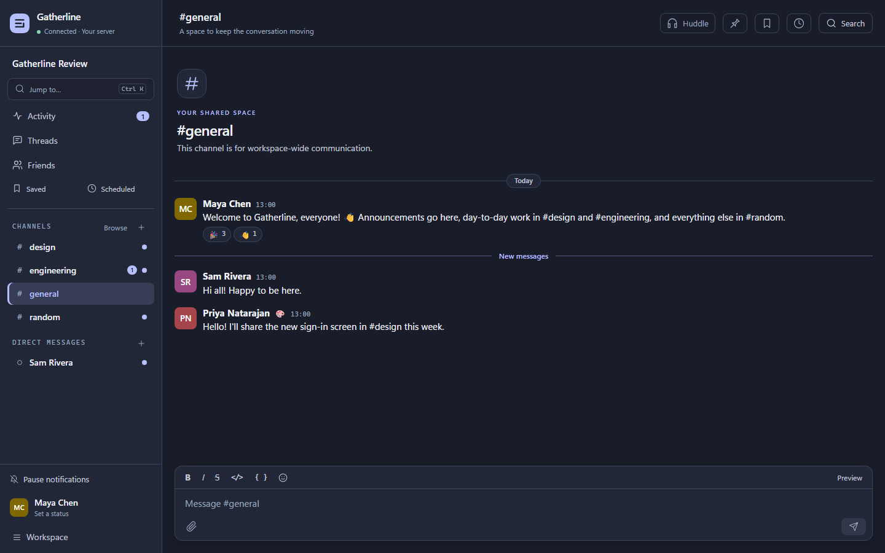
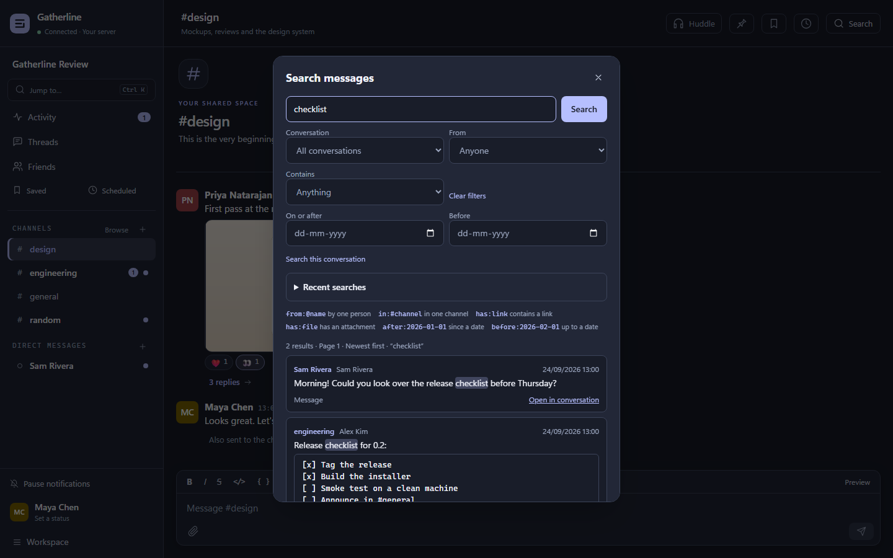
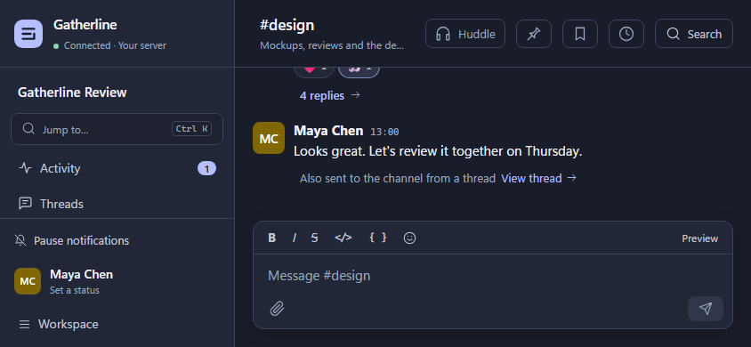
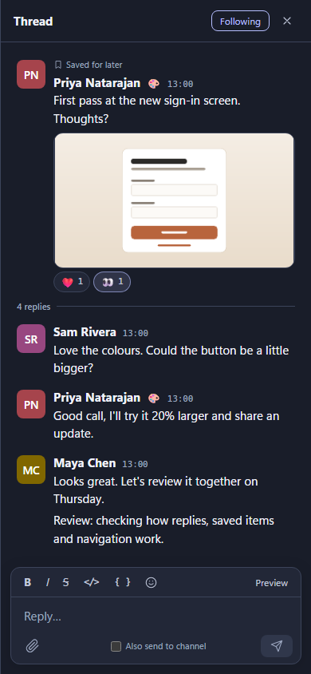

# Tandem product audit — September 24, 2026

This audit examines the current source, rather than treating the README or previous improvement plans as proof of implementation. It covers the shared web/desktop interface, client behavior, relevant protocol shapes and hosting foundations. Source references identify the implementation inspected; they are not claims that every behavior was exercised in a running app. The browser walkthrough and test results are recorded separately below. No application source or pre-existing documentation was changed for this review.

For priorities, sequencing, estimates and acceptance criteria, see the [product improvement plan](PRODUCT-ROADMAP-2026-09-24.md).

The user's intended audience is **“for everyone.”** The appropriate product structure is a universal communication core, with optional capabilities for friends, communities, teams and organizations. Personal chat should not require learning workplace administration; a work deployment should not require a social friend graph. This audit therefore recommends adaptable entry points and progressive disclosure, rather than limiting the product to small teams or placing every feature in every user's navigation.

## Current capability map

| Area                | Present in current source                                                                          | Partial or missing                                                                              |
| ------------------- | -------------------------------------------------------------------------------------------------- | ----------------------------------------------------------------------------------------------- |
| Conversation        | Public/private channels, DMs/group DMs, threads, mentions, edits/deletes, reactions, pins          | Quoting/forwarding, richer structured formatting, a complete reaction chooser                   |
| Sending             | Draft persistence, optimistic sends, retry/discard, scheduled messages, file attachments           | Central drafts/outbox view; attachment recovery has different limits from text recovery         |
| Attention           | Activity unread/mentions, Threads with unread counts, channel notification settings, temporary DND | Working hours, digest batching, thread-specific mute, actionable catch-up                       |
| Finding information | Search modifiers and structured filters, highlighting, recent searches, exact-message jumps        | Relevance ranking, filename/file results, dedicated file browser                                |
| Organization        | Saved/Later, channel pins, Scheduled                                                               | Reminders, completion, notes, favorite/custom sidebar sections                                  |
| People              | Profiles, statuses, presence, workspace-local friends/requests, member administration              | Avatar upload, timed statuses, local time, blocking/reporting, cross-workspace identity         |
| Calls               | Audio, camera, screen sharing, speaker indication, pinning/fullscreen                              | Device selection, preflight, network recovery and a measured participant budget                 |
| Extensibility       | Bot apps, webhooks, commands, events, interactive controls, delivery retry                         | Guided setup, tested templates, delivery history, bot scopes/access controls                    |
| Access              | Browser client, desktop client, narrow layouts, shared accessible primitives                       | Reliable phone background notifications, route-backed navigation, remaining keyboard/touch gaps |

## Findings

### 1. Navigation needs to preserve where someone was

Active channel and side panel are React state. Switching conversations does not establish a navigable URL, and incoming deep-link hashes are removed after consumption. This makes browser Back/Forward and reload poor substitutes for product navigation. Preserve channel, thread and major view in routes; restore reading position and recent workspace context. Existing exact-message links should remain compatible. Verification should cover Back from a thread, reload in a DM and opening links after sign-in.

Evidence: [WorkspaceScreen.tsx](../packages/ui/src/screens/WorkspaceScreen.tsx), lines 149, 155 and 289; [platform.ts](../packages/ui/src/platform.ts), lines 162–165. **Code finding.**

### 2. Friends are local relationships, not an independent personal messaging experience

Friends and requests explicitly stay on the current server. The Friends view opens a profile, from which someone can start a DM; it does not offer a direct message action on each person. DMs and groups already work without becoming friends. Clarify these concepts during joining, add direct conversation shortcuts and make the people directory discoverable. A personal/community setup can emphasize Friends; a team setup can emphasize People. A shared identity across servers, cross-server messaging and federation would each require deliberate design, not a cosmetic global Friends tab.

Evidence: [FriendsDialog.tsx](../packages/ui/src/components/FriendsDialog.tsx), lines 75–132; [ProfileDialog.tsx](../packages/ui/src/components/ProfileDialog.tsx), lines 51–64; [Sidebar.tsx](../packages/ui/src/components/Sidebar.tsx), line 155. **Code finding.**

### 3. Activity can become a useful daily catch-up

Activity currently fetches a paginated snapshot with unread and mentions filters and manual Refresh. It supports opening a conversation and marking it read through a message. Extend this into grouped conversations, followed-thread replies and explicit done/snooze actions, with quiet live updates. Pair it with working hours, digest batching and thread notification controls. Measure whether people find and handle what needs attention, rather than maximizing unread counts. A deterministic catch-up should work before adding optional AI summaries.

Evidence: [ActivityPanel.tsx](../packages/ui/src/components/ActivityPanel.tsx), lines 20, 36, 48 and 172; [notify.ts](../packages/client-core/src/notify.ts), line 28. **Code finding.**

### 4. Saved messages need follow-through; navigation needs personal organization

The sidebar says “Saved,” while the resulting panel says “Later.” It is a bookmark list with an open-message action, without reminders, notes or completion. Add these incrementally and choose consistent terminology. Channels are alphabetically sorted and DMs use recent activity; neither has custom sections or favorites. Add favorites, collapsible sections, hidden inactive DMs and a drafts/outbox view before building a full task-management product.

Evidence: [MessageListPanel.tsx](../packages/ui/src/components/MessageListPanel.tsx), `LaterPanel`; [Sidebar.tsx](../packages/ui/src/components/Sidebar.tsx), lines 64–65; [Composer.tsx](../packages/ui/src/components/Composer.tsx), line 54. **Code finding.**

### 5. Search improvements should target retrieval quality

Author/channel/attachment/date filters, query modifiers, result highlighting, recent searches and context jumps already exist. Results explicitly use newest-first ordering and represent messages, with attachments counted rather than surfaced as file results. Add relevance/newest controls, filename search, a Files result type and channel/workspace file browsers. Query suggestions can reduce dependence on remembered syntax. Preserve access checks across every new result type.

Evidence: [SearchDialog.tsx](../packages/ui/src/components/SearchDialog.tsx), lines 183, 194, 205, 262 and 316; [Attachments.tsx](../packages/ui/src/components/Attachments.tsx), line 33. **Code finding.**

### 6. Threads can preserve knowledge instead of hiding it

Thread following, unread counts, global thread discovery, pagination and exact reply jumps are implemented. Opening a thread loads its latest view; remembered reading position, independent mute and resolved/accepted-answer states are absent. Add those first. Optional titled discussions and decisions linked to their source threads could then support community questions, family planning and team decisions using the same core. Do not silently convert an ordinary chat reply into an authoritative answer.

Evidence: [ThreadPanel.tsx](../packages/ui/src/components/ThreadPanel.tsx), lines 37, 98 and 139; [MessageListPanel.tsx](../packages/ui/src/components/MessageListPanel.tsx), `ThreadsPanel`. **Code finding.**

### 7. Responsive layout is present; dependable phone use is unfinished

The stylesheet hides the sidebar and overlays side panels below 760 pixels. Message actions depend on hover or focus, without a dedicated persistent touch menu. Add a clear touch overflow action, coherent phone Back behavior, comfortable targets, safe-area handling and software-keyboard testing. Web notifications are created by the running page; no service worker, push subscription or install manifest was found. Closed-app phone notifications require a separate implementation and real-device validation. Decide the self-hosted push/privacy model before promising mobile equivalence.

Evidence: [theme.css](../packages/ui/src/theme.css), lines 121 and 145; [MessageItem.tsx](../packages/ui/src/components/MessageItem.tsx), line 226; [platform.ts](../packages/ui/src/platform.ts), line 131. **Code finding; real-device behavior remains to verify.**

### 8. Accessibility work should finish specific interaction gaps

Every message is a Tab stop; introduce efficient message-list navigation. The quick switcher lacks a labelled combobox/listbox relationship, channel-detail tabs lack selected-state semantics, and reactions rely on emoji/count plus native title text. Expose meaningful reaction names, participants and pressed state. Add a visible Help/Shortcuts entry and support light/system theme and density preferences. Preserve the shared modal, confirmation, toast, tooltip, list-status, contrast and reduced-motion work already completed.

Evidence: [MessageItem.tsx](../packages/ui/src/components/MessageItem.tsx), lines 78 and 180; [QuickSwitcher.tsx](../packages/ui/src/components/QuickSwitcher.tsx), line 76; [ChannelDetailsDialog.tsx](../packages/ui/src/components/ChannelDetailsDialog.tsx), line 172; [theme.css](../packages/ui/src/theme.css), line 32. **Code finding.**

### 9. Profiles and community trust need stronger foundations

Profiles edit display name, emoji and status text; avatars are generated initials. There is no status expiry or time-zone context, and non-online presence is displayed as “Away.” Add avatar upload, expiry presets, local time and explicit presence behavior. For communities, prioritize blocking/muting people, reporting and an understandable moderation path before public discovery or growth features. Optional organization policies should build on the same permission system without burdening a private friends server.

Evidence: [ProfileDialog.tsx](../packages/ui/src/components/ProfileDialog.tsx), lines 38 and 92; [Avatar.tsx](../packages/ui/src/components/Avatar.tsx), line 1; [entities.ts](../packages/protocol/src/entities.ts), line 13. **Code finding.**

### 10. Calls and integrations need approachable setup

Calls request default devices; no device enumeration/picker or ICE restart implementation was found. Prioritize microphone testing, device switching, reconnect/rejoin and useful network diagnostics before larger meetings. Integrations already have substantial infrastructure and an honest compatibility notice. Add tested starter recipes, connection tests, copyable setup examples, delivery history and explicit bot channel access. Avoid promising arbitrary Slack apps will work by changing a URL.

Evidence: [huddle.ts](../packages/client-core/src/huddle.ts), lines 104, 299, 400 and 443; [AppsDialog.tsx](../packages/ui/src/components/AppsDialog.tsx), lines 224, 231, 488, 546 and 616. **Code finding.**

### 11. Small inconsistencies undermine otherwise useful features

The DND option “Until tomorrow” is a fixed twelve hours. The shortcut sheet says Enter always sends despite an existing newline preference. Quick-switcher arrows with no matches calculate modulo zero, and the empty result has no explanatory message. Profile saving uses `try/finally` without a visible failure path; profile/switcher DM creation also lacks surfaced errors. Fix these in a focused polish pass, then exercise failures and empty states across the complete user journey.

Evidence: [Sidebar.tsx](../packages/ui/src/components/Sidebar.tsx), line 321; [ShortcutsDialog.tsx](../packages/ui/src/components/ShortcutsDialog.tsx), line 16; [AccountDialog.tsx](../packages/ui/src/components/AccountDialog.tsx), line 171; [QuickSwitcher.tsx](../packages/ui/src/components/QuickSwitcher.tsx), lines 69 and 91; [ProfileDialog.tsx](../packages/ui/src/components/ProfileDialog.tsx), lines 58 and 88. **Code findings; not runtime-reproduced in this audit.**

## Reading previous plans accurately

[The earlier improvement plan](IMPROVEMENT-PLAN-2026-09.md) combines original proposals and later completion notes. [Remaining work](REMAINING-WORK-2026-09.md) is a better starting point, but its measurements and intermediate statuses also need checking against current source. Do not reopen completed work under generic labels such as “add search filters,” “add responsive support,” “add drafts,” “add threads” or “make all dialogs accessible.” Browser invites/deep links, notification consent, scheduled-message recovery, shared confirmations, retry notices and the documented list-status migrations are already present.

Use the new roadmap for ordering and acceptance criteria. Keep this document as the evidence baseline, recording later runtime observations with their date, environment, successful journeys and untested boundaries.

## Hosting and platform findings

The platform review checked the server, desktop host, client synchronization, deployment guide, validation notes and CI configuration. These are source/documentation findings, not a newly completed security or scale audit.

| Area                      | Already implemented                                                                                                                | Remaining opportunity and evidence                                                                                                                                                                                                                                                            |
| ------------------------- | ---------------------------------------------------------------------------------------------------------------------------------- | --------------------------------------------------------------------------------------------------------------------------------------------------------------------------------------------------------------------------------------------------------------------------------------------- |
| Accounts and access       | Owner claiming, password changes, session listing/revocation, recovery, deactivation, ownership transfer and audit history         | MFA, explicit workspace policy, community moderation and scoped bots. [Server routes](../packages/server/src/server.ts), account/admin sections; [authentication](../packages/server/src/auth.ts)                                                                                             |
| Data recovery             | Snapshot backups, file inventories/checksums, verification, staged restore, preservation of superseded data and pre-upgrade copies | Expose manual recovery in Manage hosting; add scheduling/off-device destinations later. [backup.ts](../packages/server/src/backup.ts), lines 146, 203 and 285; [db.ts](../packages/server/src/db.ts), lines 442 and 507                                                                       |
| Hosted workspace identity | Existing desktop hosting and last-hosted resume offer                                                                              | Name normalization determines the folder: `Team A` and `Team-A` collide, and wholly non-Latin names fall back to `workspace`. Add stable IDs and safe adoption of existing folders before multi-workspace/rename/import UI. [hosting.ts](../apps/desktop/src/main/hosting.ts), lines 283–314  |
| Storage and operation     | Retention, durable attachment cleanup, upload quotas, health endpoint and storage usage API                                        | Host overview, backup freshness, physical disk warnings and redacted diagnostic bundle. Do not describe all operational visibility as absent. [server.ts](../packages/server/src/server.ts), lines 690 and 1613; [storageBudget.ts](../packages/server/src/storageBudget.ts)                  |
| Reliability               | Event replay/resync, nonce reconciliation, durable text drafts/outbox and bounded timelines                                        | Call recovery after socket loss, richer persistent attachment handling, bounded route drain on shutdown and conflict-aware native edits. [workspace.ts](../packages/client-core/src/workspace.ts), lines 426 and 1518; [server.ts](../packages/server/src/server.ts), shutdown implementation |
| Distribution and capacity | CI configuration covers Linux web/server/container checks and Windows packaging/tests; further builder targets exist               | Verified macOS/Linux releases, signing/update delivery and representative workload measurements. Targets alone are not verified releases. [.github/workflows/ci.yml](../.github/workflows/ci.yml); [validation limits](VALIDATION.md)                                                         |

The README says GitHub CI has not run, while the validation document records a passing run. This review did not independently query that remote run. Reconcile such claims against current CI evidence when preparing release documentation. Older test counts and benchmark numbers should remain dated observations, not current capacity promises.

## Runtime walkthrough — September 24, 2026

**Environment:** current checkout `d45fe2d` plus the pre-existing working changes; Windows; locally built browser client and standalone server at loopback port 19543; isolated seeded test data. Existing workspace data was not used. Browser automation used Chromium with desktop and touch-capable viewport emulation. The collaborative preview inspection failed, so the walkthrough used local Playwright screenshots and accessibility snapshots.

| Journey                | What was exercised or inspected                                                 | Result / observation                                                                                                                                                                                          |
| ---------------------- | ------------------------------------------------------------------------------- | ------------------------------------------------------------------------------------------------------------------------------------------------------------------------------------------------------------- |
| Sign-in and channels   | Signed in as the demo owner; browsed general, design and engineering            | Straightforward workspace-specific sign-in; channel intro occupies substantial vertical space at the start of short histories                                                                                 |
| Navigation persistence | Selected `#design`, confirmed the URL stayed at `/`, then reloaded              | **Reproduced:** app returned to `#general`; this supports A1 in the roadmap                                                                                                                                   |
| Threads                | Opened the seeded discussion, inspected following/replies and posted a reply    | Reply appeared; thread panel offers its own composer and also-send-to-channel option                                                                                                                          |
| Search                 | Searched `checklist` across conversations                                       | Found the seeded DM and engineering message; highlights, filters and newest-first labeling were present                                                                                                       |
| Activity               | Opened the loaded unread list                                                   | Individual-message rows with Open and Read through here; grouping/follow-up remain useful improvements                                                                                                        |
| Saved and pins         | Saved the design message; opened Saved; inspected the engineering pin           | Both surfaced message context and navigation; Saved opened a panel titled Later                                                                                                                               |
| Scheduling             | Scheduled a draft and inspected the resulting item                              | Custom date/time and device-zone guidance exist; queued item exposes Edit text, Cancel, Send now and Change time                                                                                              |
| Direct messages        | Opened Sam's DM and sent a message                                              | Message appeared with existing conversation context                                                                                                                                                           |
| Images                 | Opened the mockup lightbox                                                      | Image, filename, save and close controls were present                                                                                                                                                         |
| People and settings    | Inspected Friends, member administration, invite, app setup and account dialogs | Local-friends boundary and integration limitations are visible; account/device controls and storage usage exist; loopback invite warning correctly explains non-shareability                                  |
| Huddle controls        | Started and left a single-person huddle using fake capture devices              | Active state, waiting message, microphone/camera/share/leave controls were visible; this alone does not establish network call reliability                                                                    |
| Responsive layouts     | Inspected 1440×900, 1280×800, 390×844, 844×390 and 768×1024 views               | No document-level horizontal overflow in the three measured resized layouts. At 844×390 the desktop sidebar remains, leaving little visible navigation space. Thread becomes a full-screen view at 390 pixels |

The scripted walkthrough surfaced no uncaught page errors in its recorded surface/action runs. Some early captures recorded legitimate lazy-loading states; these were not treated as broken features. Native phone keyboards, browser chrome, safe areas, background execution and push delivery were not reproduced by viewport emulation.

### Visual evidence

The ordinary workspace already has a consistent visual identity and a clear conversation/composer structure. The next pass should improve use of space and interaction, retaining that foundation.

Search already includes structured filters, query help, highlighting and conversation context. Relevance and file discovery are the additions to prioritize.

The short landscape layout retains a full desktop sidebar. This supports using available height and input method, as well as width, when refining navigation.

The narrow thread view makes effective use of the screen. Its next validation step is a real phone with the software keyboard, touch actions and Back navigation.

### Verification and limits

- `pnpm build`: successful; Turbo reused cached build outputs.
- `pnpm test:e2e`: **12 passed in 38.6 seconds**. Coverage included two-user messaging/reconnect/friends; WebRTC packet and frame checks with fake capture sources; bounded timeline and narrow-window behavior; app actions/forms; deactivation and secret rotation; revocable/browser invites; message links; notification consent and destinations; demo seeding.
- No unit-suite, packaged-desktop-suite, real-network media, real-device push, macOS/Linux installation, large-workspace capacity or independent security assessment was rerun here.
- Screenshots contain only seeded review data. Four representative images are retained alongside this document; temporary scripts, runtime data and additional captures remain under ignored `test-results/product-review-2026-09-24/`.

The review supports a grounded product roadmap. It does not certify all features, deployments or audience-specific requirements as production-ready.
