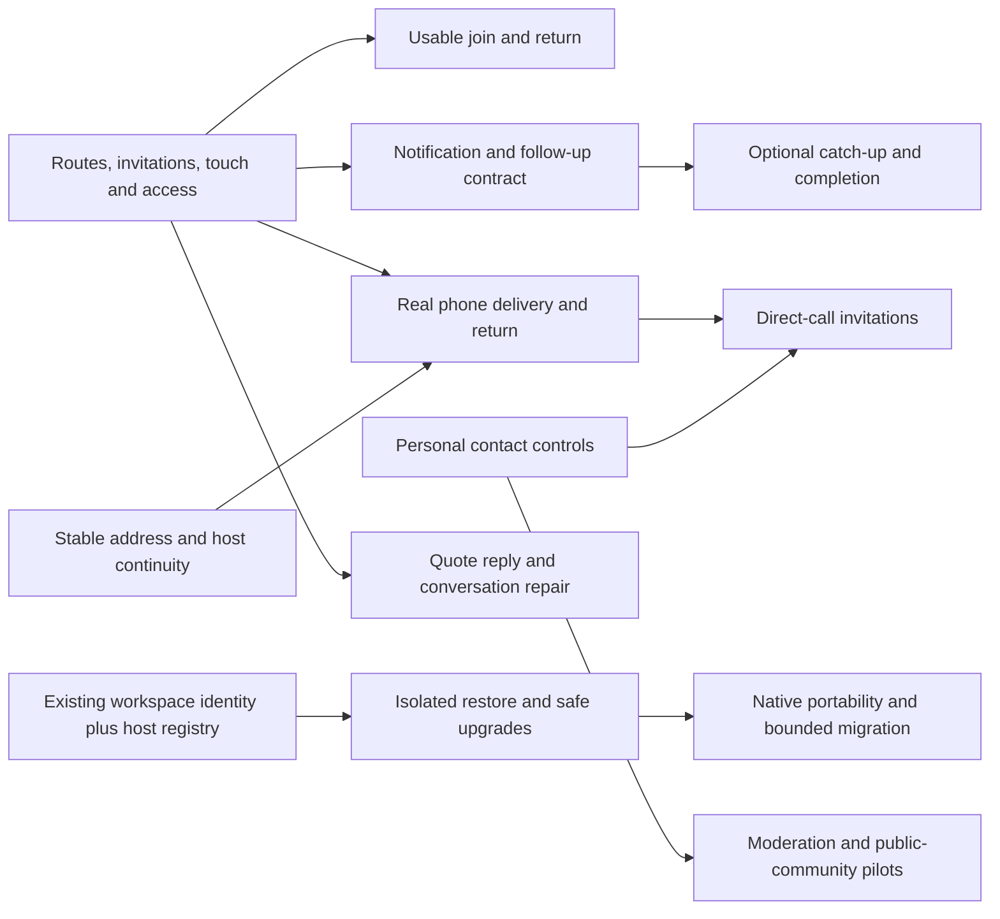

# Gatherline: product improvement plan

**Current execution plan, 30 September:** the [complete update plan](UPDATE-PLAN-2026-09-30.md) reconciles implementation status and remaining work against `7d91fd3`; the [optimization plan](OPTIMIZATION-PLAN-2026-09-30.md) adds measured candidates and pinned source comparisons. This roadmap retains its product direction and dated hypotheses; its original schedule and status descriptions are historical.

**Reviewed September 24; revised September 25, 2026 · Current checkout: `d45fe2d` plus existing local changes**

**Direction: a welcoming communication app for friends, communities, teams, and organizations, with control over where their conversations live.**

Gatherline already has enough chat functionality to support serious trials. The biggest opportunity is to connect those features into an experience people can understand, trust, and return to: easy joining, dependable phone access, useful catch-up, findable answers, and hosting that does not require a developer.

“For everyone” is the product vision. The implementation should have a shared core and optional capabilities, with different defaults for different groups. A family group should not have to navigate enterprise administration; an organization should be able to enable stronger access controls. Everyone should get the same dependable messaging foundation.

**September 25 revision:** the [deeper research and decision report](PRODUCT-RESEARCH-2026-09-25.md) strengthens phone/reachability gates, personal contact controls, direct-call invitations, migration, and recovery. The sequence and twelve-week envelope below have been revised accordingly. The [source register](research/2026-09-24/SOURCE-REGISTER.md) distinguishes published capabilities, user reports and studies.

This is a forward plan, not a record of completed implementation. The [companion product audit](PRODUCT-AUDIT-2026-09-24.md) records current capabilities and evidence. Existing September improvement documents remain useful history; several of their original recommendations have already shipped.

## 1. Assessment of the current product

| Area                  | Current state                                                                                                         | What the next upgrade should achieve                                                                        |
| --------------------- | --------------------------------------------------------------------------------------------------------------------- | ----------------------------------------------------------------------------------------------------------- |
| Core conversations    | Public/private channels, DMs/groups, threads, reactions, mentions, edits, pins and exact-message links exist          | Preserve navigation context; improve composition, touch actions and organization                            |
| Attention             | Activity, followed Threads, unread state, channel notification controls and DND snoozing exist                        | Help someone identify what needs attention after time away without inspecting every message                 |
| Search and reference  | Filters, modifiers, highlights, recent searches, pagination and context jumps exist                                   | Relevance, file discovery and durable answers; adding basic search again would waste effort                 |
| Personal follow-up    | Saved messages, persistent text drafts/outbox and editable/reschedulable scheduled sends exist                        | Reminders, completion, draft overview and clear pending-work states                                         |
| People                | Profiles/status, presence, workspace-local friends, roles and device/session controls exist                           | Approachable directory, avatars, local time, availability and optional community controls                   |
| Calls                 | Audio, camera, screen sharing, speaker state and configured TURN support exist                                        | Device selection, connection diagnosis, recovery and a measured call-size limit                             |
| Ownership             | Desktop/LAN hosting, browser access, tunnels, CLI backup/restore, retention and upgrade backups exist                 | A person can operate and recover a workspace through the app                                                |
| Extensibility         | Bots, webhooks, slash commands, event retries, interactive buttons/forms and an explicit compatibility contract exist | Verified recipes, setup testing, scoped access and quieter automation                                       |
| Devices and inclusion | Responsive browser UI, Windows desktop and substantial accessibility work exist                                       | Real phone use, additional verified OS packages, themes, language support and remaining accessibility fixes |
| Broader adoption      | Working product foundation and CI configuration exist                                                                 | Import/export, release distribution, capacity evidence and pilot feedback                                   |

**What I would preserve:** the recognizable visual identity, local hosting, portable workspace storage, bounded timeline, transparent integration limitations, and ability to use the browser without installing an app. A wholesale redesign or stack rewrite has little evidence behind it today.

**What I would change first:** navigation that loses your place, discovery of common actions, phone interactions, and the gap between technically available hosting/recovery capabilities and what a normal host can actually do.

## 2. One core, adaptable to different groups

Treat these as optional starter presets, not separate products, separate accounts, or permanent restrictions. A workspace can change its settings later. Presets configure defaults; authorization remains explicit and enforced by the server.

| Audience                           | First successful experience                                    | Useful optional defaults/capabilities                                                        | Avoid imposing                                                    |
| ---------------------------------- | -------------------------------------------------------------- | -------------------------------------------------------------------------------------------- | ----------------------------------------------------------------- |
| Friends and families               | Open an invite, recognize people, send a photo, start a call   | Prominent DMs/friends, photo gallery, expressive reactions, polls, optional events           | Work terminology, task queues, mandatory conversation titles      |
| Clubs, creators and communities    | Join, understand the group, find relevant conversations        | Welcome/rules, interest channels, moderators, reporting, discussion view, events             | Exposure to every channel or unsolicited DMs by default           |
| Project groups, students and teams | Find the project, ask a question, get back to its answer       | Optional titled threads, decisions, reminders, files, quiet hours, integrations              | A compulsory project-management system                            |
| Organizations                      | Invite a group, manage access, operate the service confidently | Guests, policy controls, MFA, identity-provider sign-in, audit/export and managed deployment | Claims of enterprise readiness before operational evidence exists |

Universal requirements are readable text, keyboard and assistive access, predictable notifications, a fast join flow, reliable message delivery, understandable privacy, and useful behavior on phones and slower networks.

The host and the participant have different jobs. Joining should require a link and a clear sign-in/create-account step. Hosting may expose storage, network and backup settings. Put those settings in a host control center, not the participant's everyday flow.

## 3. What to learn from Slack criticism and the wider market

These are researched design inputs, not a claim that all Slack users are dissatisfied. Official documentation establishes product behavior; public discussions suggest questions to test. Some threads contain promotion and contradictory experiences, so they are not representative surveys.

| Pain or lesson                                            | Evidence                                                                                                                                                                                                                                                                                                                                                              | Implication for Gatherline                                                                                                                                                                                                                                                             |
| --------------------------------------------------------- | --------------------------------------------------------------------------------------------------------------------------------------------------------------------------------------------------------------------------------------------------------------------------------------------------------------------------------------------------------------------- | -------------------------------------------------------------------------------------------------------------------------------------------------------------------------------------------------------------------------------------------------------------------------------------- |
| Older history becomes inaccessible or disappears          | Slack Free exposes 90 days of searchable messages/files and deletes content older than one year. [Slack limits](https://slack.com/help/articles/115002422943-Usage-limits-for-free-workspaces)                                                                                                                                                                        | Make history retention an understandable owner choice, with storage estimates, export and verified restore. Do not promise infinite storage.                                                                                                                                           |
| Subscription costs grow with membership                   | Slack charges by membership and billing term; the Pro microsite and main pricing page returned differently localized/promotional offers. Verify region, term and checkout before publishing savings arithmetic. [Slack Pro](https://slack.com/pricing/pro)                                                                                                            | Show an honest ownership-cost comparison, including hosting, backups, bandwidth and maintenance. Free software still has operating costs.                                                                                                                                              |
| Threads and notification badges can become work to manage | Discussions describe missed replies, notification overload and crowded UI, while some respondents defend Slack's search and threading. [May 2025 discussion](https://www.reddit.com/r/Slack/comments/1kd04ln/whats_your_biggest_frustration_with_slack/), [September 2026 wishlist](https://www.reddit.com/r/Slack/comments/1wbyzw3/what_do_you_wish_slack_had/)      | Measure missed replies and catch-up time. Make follow, mute, read and done states clear. Slack already has thread notification controls; the opportunity is understandable behavior. [Slack threads](https://slack.com/help/articles/115000769927-Use-threads-to-organize-discussions) |
| Important conclusions vanish into chat history            | Users describe difficulty turning a useful conversation into lasting knowledge; Basecamp makes a similar design argument. [User discussion](https://www.reddit.com/r/Slack/comments/1tfr10u/slack_feels_powerful_but_i_feel_like_im/), [Basecamp essay](https://basecamp.com/guides/group-chat-problems)                                                              | Let people record an answer or decision with a source thread, author and date. The Basecamp essay is a competitor's position, not independent research.                                                                                                                                |
| Read does not mean finished                               | Twist separates relevant active conversations from those marked Done. [Twist inbox](https://twist.com/help/articles/what-is-the-inbox-r2KEWZwI)                                                                                                                                                                                                                       | Personal completion and snoozing should be separate from read receipts and unread state.                                                                                                                                                                                               |
| Conversations need handles people can remember            | Zulip uses named topics and supports resolving/reopening them. [Topics](https://zulip.com/help/introduction-to-topics), [Resolution](https://zulip.com/help/resolve-a-topic)                                                                                                                                                                                          | Offer optional thread titles, full-width reading and open/resolved state. Preserve effortless casual chat.                                                                                                                                                                             |
| Communities need structure and moderation                 | Discord offers forum titles/tags, tailored channel onboarding and moderation tools. [Forums](https://support.discord.com/hc/en-us/articles/6208479917079-Forum-Channels-FAQ), [Onboarding](https://support.discord.com/hc/en-us/articles/11074987197975-Community-Onboarding-FAQ), [AutoMod](https://support.discord.com/hc/en-us/articles/4421269296535-AutoMod-FAQ) | Build optional discussion views and interest selection; provide reporting, boundaries and moderator tools before promoting unrestricted public communities.                                                                                                                            |
| Bookmarks are useful only if people return to them        | Slack itself supports reminders and completed/archived saved items. [Slack Later](https://slack.com/help/articles/360042650274-Save-messages-and-files-for-later)                                                                                                                                                                                                     | Improve Gatherline's existing Saved list. This is useful parity, not an invented competitive advantage.                                                                                                                                                                                |
| Self-hosted mobile still has infrastructure dependencies  | Mattermost documents mobile push relays and Apple/Google delivery. WebKit documents push for installed Home Screen web apps. [Mattermost mobile](https://docs.mattermost.com/deployment-guide/mobile/mobile-faq), [WebKit push](https://webkit.org/blog/13878/web-push-for-web-apps-on-ios-and-ipados/)                                                               | Decide the push and hosting model early; distinguish responsive layout from dependable background notifications. Test actual devices.                                                                                                                                                  |
| Data ownership and confidentiality are different          | Element couples encrypted conversations with device/key-recovery design. [Element encryption](https://web-docs.element.dev/e2ee.html)                                                                                                                                                                                                                                 | Describe Gatherline as host-controlled storage, not end-to-end encryption. Encryption needs a separate design for search, bots, recovery and multiple devices.                                                                                                                         |
| Switching tools can strand history                        | Slack export coverage varies by plan and authorization, and exports contain file links. [Slack exports](https://slack.com/help/articles/201658943-Export-your-workspace-data)                                                                                                                                                                                         | Start with Gatherline's own complete portable export, then a bounded Slack import with preview and an honest missing-content report.                                                                                                                                                   |

Search, documents, task lists and AI already exist in Slack's current paid offering. Competing on a claim that Slack has none of these would be misleading. Gatherline's opportunity is how easily people can use and own the whole experience. [Slack Pro capabilities](https://slack.com/pricing/pro)

## 4. Prioritized upgrade backlog

**P0:** foundations for a broader release. **P1:** the next meaningful product capabilities. **P2:** audience expansion after those foundations. **Conditional:** fund when a concrete use case justifies the architecture or operating cost.

Effort is a rough engineering planning band, not a delivery promise: **S** = 1–3 focused days; **M** = 4–10 days; **L** = 2–4 engineer-weeks; **XL** = 5–8+ engineer-weeks and should be split. Includes ordinary implementation and validation, but not staffing delays, external approvals or production operation. Add contingency after design spikes. These items are not all part of the first release.

### A. Make the existing experience feel complete

| ID  | Priority / effort               | Upgrade                                                                                                                 | Definition of done                                                                                                                                                                                                                                                    |
| --- | ------------------------------- | ----------------------------------------------------------------------------------------------------------------------- | --------------------------------------------------------------------------------------------------------------------------------------------------------------------------------------------------------------------------------------------------------------------- |
| A1  | P0 / L                          | URL-backed channels, threads and main views; Back/Forward; restore conversation and scroll position                     | Open a thread, navigate elsewhere, go Back, then reload: return to the expected context without losing a draft. Existing message/invite links still work.                                                                                                             |
| A2  | P0 / M                          | Touch message menu, responsive navigation, accessible switcher/tabs/reactions and efficient keyboard message navigation | Main journeys work with touch and keyboard; 200% zoom and short/landscape windows remain usable; phone overlays manage focus and Back.                                                                                                                                |
| A3  | P0 / S–M                        | Small correctness and feedback fixes                                                                                    | Correct “Until tomorrow”; shortcut help matches Enter preference; zero-result switcher remains usable; profile/DM failures preserve input and offer retry; Saved/Later naming is consistent.                                                                          |
| A4  | P0 / M                          | Short member onboarding and visible Help                                                                                | A new member recognizes the group and host, chooses a name and sends a first message. Invite/QR destination survives sign-in; expiry/revocation has a useful recovery path. Preview the newcomer experience. Help exposes shortcuts, troubleshooting and diagnostics. |
| A5  | P1 / M                          | Personal organization                                                                                                   | Favorites, collapsible sections, recent conversations and hiding inactive DMs; account/workspace-scoped preferences survive restart.                                                                                                                                  |
| A6  | P1 / M                          | Appearance and reading preferences                                                                                      | Light/dark/system themes, compact/comfortable spacing and font scaling; readable focus/contrast in each supported combination.                                                                                                                                        |
| A7  | P1 / M                          | Profiles and availability                                                                                               | Avatar upload/crop, time zone/local time, status expiry, clear online/away/offline behavior; optional profile fields are genuinely optional.                                                                                                                          |
| A8  | P1 / M                          | Complete ordinary composition                                                                                           | Lists, quotes, labeled links, quote reply and a full reaction picker; preview and rendering agree; pasted code and IME composition behave predictably.                                                                                                                |
| A9  | P0 discovery, P2 breadth / L    | Language and localization foundation                                                                                    | Test mixed scripts, input methods, large text and locale-aware dates during core work. Extract strings and validate a second language, plurals and right-to-left layouts with native speakers before claiming support.                                                |
| A10 | P0 contract, P1 delivery / L–XL | Multiple workspaces with clear background activity                                                                      | Saved accounts remain separate. Define inactive-workspace delivery, badges, connection/resource budgets and notification-tap routing. Test two servers and revoked/expired sessions. A unified identity or federation is outside this package.                        |

A1–A4 should use the existing components and visual language. This is a coherent usability pass, not another branding project.

### B. Help people catch up and find the answer

| ID  | Priority / effort              | Upgrade                                 | Definition of done                                                                                                                                                                                                                                                                                                                                            |
| --- | ------------------------------ | --------------------------------------- | ------------------------------------------------------------------------------------------------------------------------------------------------------------------------------------------------------------------------------------------------------------------------------------------------------------------------------------------------------------- |
| B1  | P1 / L                         | Conversation-based catch-up             | Evolve Activity with grouped updates, direct asks and followed-thread replies; explain why each item appears; update quietly without moving what someone is reading.                                                                                                                                                                                          |
| B2  | P1 / L                         | Useful personal follow-up               | Add done/reopen and reminders to Saved; optional notes; an overview of drafts and pending sends. Read and done are separate. Reminder delivery survives restart.                                                                                                                                                                                              |
| B3  | P0 contract, P1 delivery / M–L | Predictable notification policy         | Define unread, follow-up and subscription states together. Recurring quiet hours, per-thread mute, digest options and content privacy follow. Explain why an event does or does not interrupt; test followed replies, unseen replies in the active channel, replay and device consistency.                                                                    |
| B4  | P1 / M                         | Findable threads                        | Optional titles, full-width thread view, remembered position, participant/last-reply context and thread search. Existing untitled threads require no migration effort from users.                                                                                                                                                                             |
| B5  | P1 / L                         | Better search and a Files view          | Relevant/newest ordering, filename/metadata search, image grid, file-type/person/date filters, clear message/thread/file result types. Permission removal is enforced immediately by the server; connected clients promptly remove inaccessible results/previews. Define offline-cache expiry and cleanup on reconnect; downloaded copies cannot be recalled. |
| B6  | P2 / L                         | Answers and decisions                   | Accepted answer or concise decision with recorder/date/source, revision and superseded/reopened state. Begin inside source access scope; wider sharing previews content and destination. Define source deletion and membership changes.                                                                                                                       |
| B7  | P2 / M                         | Safe context sharing                    | Forward/quote with source attribution and destination access checks; optional bounded link previews using existing outbound-network protections.                                                                                                                                                                                                              |
| B8  | P2 / L–XL                      | Repair a conversation after it branches | Prototype same-channel split/move after A1. Preserve attribution, links, subscription state and a visible move trail; prevent stale composers replying into the wrong place. Cross-channel moves require a separate access design.                                                                                                                            |

Design B1–B3 around independent **Unread**, **Follow-up** and **Subscription** states. **Resolved** is a separate shared outcome. Done must not silently unfollow or close everyone else's discussion. Specify revival after new replies and snoozed mentions. Existing notification decision reasons can support explanations; following currently does not independently trigger a desktop interruption. Validate that expectation rather than assuming it is a defect. Keep catch-up optional for casual groups.

Start B5 with filenames and metadata. PDF text extraction, OCR and audio transcription are separate later jobs with size, resource and access controls. Start B6 with compact records rather than a collaborative document suite.

### C. Make joining and hosting approachable

| ID  | Priority / effort                              | Upgrade                                       | Definition of done                                                                                                                                                                                                                                                                                                        |
| --- | ---------------------------------------------- | --------------------------------------------- | ------------------------------------------------------------------------------------------------------------------------------------------------------------------------------------------------------------------------------------------------------------------------------------------------------------------------- |
| C1  | P0 / M                                         | Stable desktop hosting registry               | Protocol workspace identity already exists. Replace display-name-derived desktop folders with an explicit registry linked to immutable IDs. Adopt existing folders safely; Team A, Team-A and non-Latin names remain distinct.                                                                                            |
| C2  | P0 / L (2–4 engineer-weeks)                    | Host control center and manual backup/restore | Show reachability, stable/temporary address, backup freshness and storage. Reuse verified backup primitives. Inventory external settings/secrets and compatibility; add free-space checks. A non-developer restores onto a fresh install. Isolate test restores so scheduled messages and outbound jobs cannot run twice. |
| C3  | P0 reachability decision, P1 delivery / L      | Hosting continuity                            | One supported stable HTTPS/always-on path plus clear tray/quit/sleep behavior; optional start on login, bounded shutdown and address-change recovery. Explain when a host is unavailable. Isolate the embedded server if required by measured lifecycle failures.                                                         |
| C4  | P1 / L                                         | Scheduled and off-device backups              | Configurable schedule/destination, freshness and failure notices, verification and a restore drill; optional encrypted archives with an explicit recovery-key flow.                                                                                                                                                       |
| C5  | P0 / L (2–4 engineer-weeks)                    | Release and capacity discipline               | Reproducible Windows release, retained matching artifacts, checksums/changelog, client/server support policy, upgrade preflight and restoration/rollback drill. Test schema compatibility; baseline workload/soak evidence. Signing depends on available credentials.                                                     |
| C6  | P1 / L–XL per platform                         | Broader desktop distribution                  | Budget 3–6 engineer-weeks per additional platform initially. Verify macOS/Linux installation, hosting, reconnect and manual upgrades; signing/notarization where available; explicit data compatibility.                                                                                                                  |
| C7  | P1; gate for archive-sensitive adoption / L–XL | Portable native export/import                 | Budget 3–5 engineer-weeks. Versioned messages/files manifest, checksums, permissions, progress and interrupted-job recovery; round-trip validation. Distinguish logical portability from full operational backup.                                                                                                         |
| C8  | P1 for switching pilots, otherwise P2 / L–XL   | First adapter: Slack public-channel export    | Budget 3–6 engineer-weeks after C7. Import into a new workspace; dry run, author/account claiming, channels/threads/reactions, safe archive handling, resumable blobs and missing-content report. Suppress historic notifications. Inventory partners/apps and rehearse coexistence before cutover.                       |
| C9  | Conditional / XL                               | Optional managed hosting and assisted setup   | Same portable data contract, clear recurring cost and exit/export path. Trial only after self-hosted operation and upgrades are dependable.                                                                                                                                                                               |
| C10 | P2 / L–XL                                      | Automatic update delivery                     | Signed release metadata/artifacts, staged update channels, interrupted-download/install recovery, compatible schema handling and a tested restoration/rollback path. Depends on C2/C5 and each supported platform's release process.                                                                                      |

C1 is a source-confirmed desktop folder/registry limitation, not the absence of server workspace IDs or a claimed exploit. Existing draft/outbox storage already uses authenticated workspace/user scopes. Scheduled backups in C4 should use supported quiescing/snapshot semantics; do not turn live folder copying into a misleading “backup succeeded” badge.

### D. Make phones and calls dependable

| ID  | Priority / effort                                | Upgrade                                            | Definition of done                                                                                                                                                                                                                                                                                                                         |
| --- | ------------------------------------------------ | -------------------------------------------------- | ------------------------------------------------------------------------------------------------------------------------------------------------------------------------------------------------------------------------------------------------------------------------------------------------------------------------------------------ |
| D1  | P0 feasibility, cohort-gated delivery / L–XL     | Installable web app and explicit mobile push model | About 1 week feasibility, then 3–6 engineer-weeks for a bounded delivery. Stable HTTPS origin, manifest/service worker, scoped subscriptions, privacy, expiry/retry and diagnostics. Test locked iOS/Android receive/tap, denied permissions and address changes. Cold offline history is D9; background call ringing has a separate gate. |
| D2  | P1 / M                                           | Real phone messaging                               | Virtual keyboard/safe areas, camera/file uploads, image gallery, long-press/menu behavior, rotation, poor-network recovery and clear offline state on actual devices.                                                                                                                                                                      |
| D3  | P1 / M                                           | Call device setup                                  | Microphone/camera/output selection where supported, mic test, device-switch/unplug handling and join-muted preferences; a simple call still takes one clear action.                                                                                                                                                                        |
| D4  | P1 / L                                           | Call recovery and diagnostics                      | Explicit connecting/reconnecting/failed states; bounded retry/rejoin with current access checks; diagnose permission, HTTPS, network and TURN failures. Test separate networks and sleep/wake.                                                                                                                                             |
| D5  | P1 / M                                           | Publish the small-call operating envelope          | Measure 2/4/6/8 participants where feasible, audio/video/share bandwidth and CPU, weak networks and relay paths. State the supported size based on evidence; offer low-bandwidth/audio-only controls.                                                                                                                                      |
| D6  | P1 voice pilot, P2 expansion / M then L–XL       | Accessible asynchronous media                      | First scope short voice notes: preview/cancel, seek/speed, retry, duration and limits. Later scope video clips, transcripts and live captions separately with language/accuracy testing, consent and processing/storage choices. Include text alternatives.                                                                                |
| D7  | Conditional / XL                                 | Native mobile apps or larger-call infrastructure   | Native apps when measured PWA gaps block adoption; an SFU when required call size exceeds the tested mesh. Separate investment decisions, each with an operating-cost owner.                                                                                                                                                               |
| D8  | P1 for personal-call pilots / L–XL               | Direct-call invitation lifecycle                   | Foreground invite/accept/decline, cancel, busy, timeout, missed call and call-back; respect blocks and quiet hours; reconcile multiple devices. Reuse huddle media. Validate background ringing separately against OS limits and D1; message push is insufficient proof.                                                                   |
| D9  | P2; promote for demonstrated offline need / L–XL | Bounded offline reading                            | Opt-in, size-limited message cache scoped to account/workspace, cold-start reading, visible stale state, logout cleanup and reconnect revocation. Existing drafts/outbox remain the sending foundation. Never promise recall of downloaded copies or instant revocation on an offline device.                                              |

D3–D5 form a combined dependable-small-call package initially estimated at 3–6 engineer-weeks; do not add their individual bands to this combined estimate. D8 invitation semantics are additional work. Current huddles are joinable rooms; inspected source does not provide a complete direct ringing/missed-call lifecycle.

Adding a manifest alone does not make a mobile product. Background notifications, private-network reachability, battery behavior, reconnect and attachment handling are release criteria. A cloud push relay cannot make a sleeping host available.

Service-worker registrations and push subscriptions are tied to the browser origin and its registration. A temporary Quick Tunnel URL is suitable for an ad hoc visit, but changing that address does not carry an installed web app and its push subscriptions to the new origin. Supported persistent mobile setup needs a stable HTTPS address plus an explicit address-change/reinstallation flow. Immutable workspace IDs do not remove browser-origin boundaries. [Service-worker registration](https://developer.mozilla.org/en-US/docs/Web/API/ServiceWorkerContainer/register), [Push subscription](https://developer.mozilla.org/en-US/docs/Web/API/PushManager/subscribe)

### E. Optional capabilities for communities and organizations

| ID  | Priority / effort                                        | Upgrade                                  | Definition of done                                                                                                                                                                                                                             |
| --- | -------------------------------------------------------- | ---------------------------------------- | ---------------------------------------------------------------------------------------------------------------------------------------------------------------------------------------------------------------------------------------------- |
| E1a | P0 policy, P1 delivery / M–L                             | Personal contact controls (E1a)          | DM request policy, block/mute and explicit behavior for existing DMs, mentions, shared channels and calls. Enforce contact policy on the server and explain it to participants. This is universal, not only public-community work.             |
| E1b | Required before open-membership pilots / L               | Moderator tools                          | Reports, review queue, scoped roles, reasoned actions, rate limits and an appeal/contact path. Test repeat abuse and reversible actions. Automation/language breadth follows observed moderation needs. E1a/E1b split the original E1 package. |
| E2  | P1 / L                                                   | Understandable permissions and guests    | Explicit who-can-invite/create/manage/moderate policy, moderator role and channel-limited guests with expiry; old workspaces retain intended permissions. Restricted users cannot infer private content through counts or search.              |
| E3  | P1 welcome slice, P2 breadth / M–L                       | Community welcome and discovery          | Start with one welcome screen, optional interests and clear channel browser; preview as newcomer. Then rules, announcements, directory and join controls. Distinguish accessible, joined and sidebar-visible conversations.                    |
| E4  | P1 pilot-selected coordination, P2 breadth / M per slice | Polls, events and shared media           | Prioritize simple polls and event/RSVP cards where needed; closing/canceling, time zones, reminders and later retrieval work. Disclose vote visibility. Custom emoji follow measured demand; gallery work shares B5/D2.                        |
| E5  | P1 / M–L                                                 | Stronger sign-in safeguards              | Optional TOTP and recovery codes, recovery testing, notification privacy; evaluate passkeys after the cross-server/domain identity model is settled.                                                                                           |
| E6  | P1 for required pilot integration, otherwise P2 / M–L    | Useful integration onboarding            | One needed CI/monitoring/RSS recipe and optional recurring-question flow with pause/end controls. Connection tester, delivery history, scoped bot access and noise controls. Prove compatibility per adapter; never imply all Slack apps work. |
| E7  | Conditional / XL                                         | Organization deployment pack             | Identity-provider sign-in, provisioning, group policy, audit export and deployment support, driven by named pilot requirements. Legal hold/retention obligations need their own validated design.                                              |
| E8  | Conditional / XL                                         | Cross-server relationships or federation | Define identity, consent, discovery, blocking, revocation, history and host trust before implementation. Smooth workspace switching is a much smaller first step.                                                                              |

Friends already exists within a workspace. A global identity or global friends list is a different product and architectural decision. Account reuse across independently hosted servers should never be implied by the UI before it actually exists.

## 5. Recommended delivery sequence

**Revised September 25.** This sequence incorporates the deeper research. Release gates depend on the intended use; a successful desktop/private pilot cannot establish phone, public-community or organizational readiness.

| Milestone                                    | Delivery focus                                                                                 | Exit gate                                                                                                                 |
| -------------------------------------------- | ---------------------------------------------------------------------------------------------- | ------------------------------------------------------------------------------------------------------------------------- |
| **1. Join, return and understand**           | A1–A4, D1 feasibility, C1/C3 design; E1a/B3/A10 contracts; early accessibility/language trials | New participants reach the intended place unaided; routing works; hosting/phone assumptions are demonstrated or rejected  |
| **2. Trust the history and host**            | C1–C2, bounded C3 and initial C5                                                               | Fresh-destination restore includes a deployment inventory, isolates side effects and preserves a compatible recovery path |
| **3. Support the chosen participation mode** | D1/D2 for phone-led use; E1a; D3–D5/D8 for call-led use; E1b/E2 before public/guest pilots     | Actual phone/device/network/contact-policy gates pass for the declared cohort; no blanket readiness claim                 |
| **4. Reduce everyday friction**              | A5/A7/A8, narrow B1–B3 and B5; A10 when multi-space use blocks adoption                        | People return to needed conversations, act on asks and retrieve shared items with fewer errors                            |
| **5. Deepen participation and adoption**     | C7/C8/E6 for switching groups; B4/B6/B8; E3/E4/D6; A6/A9 breadth                               | A bounded migration or group-coordination journey proves useful; inclusivity measures improve                             |
| **6. Expand from evidence**                  | E7/E8, C9, D7/D9 or opt-in AI                                                                  | Named demand, a maintenance owner, operating costs and architectural decisions justify each expansion                     |

These are dependency groups, not a mandatory waterfall. Native portability moves earlier for groups bringing an archive; moderation moves earlier for public entry; voice/polls/events can precede a sophisticated inbox for personal groups. Personal contact controls must not be buried behind optional community decoration.

### First 12 weeks: a conditional capacity envelope

**Assumption:** two engineers familiar with the code, part-time product/design and QA, plus access to pilot groups. This is 24 gross engineer-weeks, or approximately **17–18 feature engineer-weeks** with 25–30% reserved for integration, investigation, feedback and defects. Staffing is not confirmed. With one engineer, reduce scope or lengthen the window.

| Window                              | Product/client emphasis                                                                                      | Platform emphasis                                                                            | Decision or review artifact                                                                    |
| ----------------------------------- | ------------------------------------------------------------------------------------------------------------ | -------------------------------------------------------------------------------------------- | ---------------------------------------------------------------------------------------------- |
| Weeks 1–2                           | Baseline join/return/find tasks; A1 route slice; worst A2/A3 issues; E1a/B3 state prototypes                 | Real-phone/stable-origin D1 spike; C1 migration design; C2 isolated restore design           | Working thin slices, recordings and estimates; choose phone-led or desktop-led delivery branch |
| Weeks 3–6                           | Complete a narrow A1/A2/A4 journey; repair pilot blockers; contact-policy implementation as capacity permits | C1/C2 guided manual recovery; minimum stable-hosting fixes; start C5 release checks          | Private-pilot join/recovery gate; re-estimate before starting another large package            |
| Weeks 7–10, phone-led branch        | Focus on D1/D2 install, receive, tap, reply and media; finish relevant E1a controls                          | Push subscriptions/retries/privacy and reachability diagnostics; address pilot failure paths | Supported device matrix and evidence; defer expanded B1/B2 and advanced calls                  |
| Weeks 7–10, desktop-led alternative | Narrow B1 grouping **or** B2 done/reopen; necessary A10 or guest slice only if it replaces other scope       | Matching state/access/reconnect work; reliability fixes                                      | Compare the chosen task against baseline; explicitly retain phone-support limitations          |
| Weeks 11–12                         | Accessibility/task rechecks, fixes, concise help and onboarding                                              | C5 release/upgrade checks, fresh isolated restore, measured workload, release notes          | Go/no-go for a precisely stated release; defer scope if gates fail                             |

The two weeks 7–10 rows are **alternatives**, not simultaneous commitments. At weeks 2 and 6, compare remaining estimates with remaining feature capacity. If the upper range does not fit, cut an optional slice or extend the window; do not consume the entire reliability reserve to preserve a feature list. Full push, call invitations, migration and a rich inbox cannot all be assumed to fit this envelope.

Protect correct access, acknowledged-message integrity, recovery and the join/send/return path. For phone-led pilots, protect delivery/reachability and cut catch-up expansion. For archive-sensitive pilots, replace an optional engagement package with C7/C8; do not layer migration onto the same budget. Public pilots remain gated on E1b/E2 even if other work ships first.

### First sprint tickets

1. Observe baseline tasks with a friend/family group, community organizer, project team and organization administrator. Ask for concrete recent failures and must-keep workflows.
2. Repair verified copy/feedback defects; check existing local Composer changes before deciding whether a shortcut issue still needs work.
3. Implement one channel/thread route and Back/reload slice, including invitation/deep-link continuity, draft preservation and denied access.
4. Expose persistent touch actions and fix the most disruptive keyboard/short-landscape issue; run an assistive-access and mixed-script smoke review.
5. Specify the desktop hosting registry migration using existing server identity. Do not redesign authenticated local draft/outbox scopes without evidence.
6. Demonstrate a manual backup and isolated restore prototype; inventory external settings/secrets and disable outbound startup jobs in the test destination.
7. Test installed/background receive/tap on an actual iPhone and Android phone at a stable HTTPS origin. Record permissions, provider dependencies and address-change behavior.
8. Write a small state table for DM requests/blocks, subscriptions/unread/done, inactive-workspace delivery and foreground call invitations. Prototype ambiguous cases; implementation follows selected pilot blockers.

## 6. Technical guardrails that keep the plan buildable

- Extend the current protocol and event model for follow-up, reminder and thread metadata; changes must replay/resync correctly and be compatible with older clients where supported.
- Keep permission checks server-side. Search indexes, counts, previews, notifications, exports and future AI retrieval must use the same access boundary as messages.
- Use immutable workspace identity for local state and registry entries; keep it distinct from display names and changeable network addresses.
- Add a small persistent job/progress pattern when reminders, exports, imports and scheduled backups require it; support cancellation, retries and duplicate-safe resume.
- Preserve source attribution and specify deletion behavior for quotes, decisions, saved items and imported history. A source link disappearing must not silently leave an unexplained copy.
- Keep SQLite and the bounded timeline until measured constraints justify a change. Test initial snapshots, reconnect bursts, large file collections and long-lived usage before claiming scale.
- Add message edit conflict detection when touching the editor; scheduled edits already have a stronger concurrency contract. Preserve both versions when an edit conflicts.
- Browser token storage and local drafts deserve an explicit threat-model review; existing desktop OS-protected credentials do not imply all local data is encrypted. Do not call a storage choice alone a demonstrated vulnerability.
- Add cross-browser, screen-reader and real-device checks around affected journeys. The current Chromium/fake-media tests remain valuable but do not establish WAN or phone behavior.
- Extract smaller modules as touched domains grow; avoid turning this roadmap into an unrelated rewrite of the server or client.

## 7. Validate outcomes, not feature count

Recruit **6–8 pilot groups** across the four audiences, including people who do not normally host software, keyboard/screen-reader users, different languages, and lower-spec phones. This is directional product evidence, not a statistically representative market study. Measure per cohort so a strong developer-team result cannot hide a poor friend-group experience.

The targets below are proposed release goals; they were **not measured as achieved** in this review.

| Outcome                                  | Proposed gate                                                                                                     | How to check                                                                                                                                          |
| ---------------------------------------- | ----------------------------------------------------------------------------------------------------------------- | ----------------------------------------------------------------------------------------------------------------------------------------------------- |
| Joining                                  | At least 8 of 10 first-time participants join and send a message unaided within 3 minutes, given a working invite | Observe the task; distinguish unreachable hosting from confusing UI                                                                                   |
| Catch-up                                 | At least 30% reduction in median time to identify the same pending asks, without more missed asks                 | Compare current and proposed UI using equivalent realistic histories                                                                                  |
| Retrieval                                | At least 8 of 10 seeded known-item tasks succeed within 60 seconds                                                | Mix old answers, images/files, DMs and threads; include permissions changes                                                                           |
| Hosting recovery                         | Every release candidate passes a restore drill onto a fresh destination                                           | Verify messages, memberships, files, scheduled work, identities and intended session behavior                                                         |
| Phone messaging                          | Join, reply, attach and reopen work on each explicitly supported device/browser combination                       | Real iOS/Android runs; include keyboard, rotation, denied permissions and poor signal                                                                 |
| Background notifications, after D1 ships | Delivery and notification-tap work on each declared supported configuration                                       | Test installed/background app states, stable origin, expired subscriptions and address changes; do not claim this support in a release that defers D1 |
| Accessibility                            | No blocking issue in join, navigation, send/reply, search and recovery for selected assistive setups              | Keyboard plus manual screen-reader checks; automated checks supplement them                                                                           |
| Calls                                    | At least 95% successful joins in the declared network/device test matrix; publish sample size                     | Separate LAN, WAN/direct and TURN cases; verify two-way media and recovery                                                                            |
| Reliability/capacity                     | No lost or duplicate acknowledged messages in the chosen soak/reconnect scenarios                                 | Report p95 latency, startup, memory, event-loop delay, queue depth and test workload                                                                  |
| Continued usefulness                     | Pilot groups voluntarily keep using the app and can name a problem it solved                                      | Weekly interviews and cohort return; compare reasons for leaving                                                                                      |

Keep analytics opt-in or operator-local where practical. Do not collect conversation contents for product metrics. Avoid treating more messages, longer sessions or more notifications as success; they can mean more distraction.

## 8. Interesting additions to keep conditional

**Private, optional AI:** a cited catch-up summary or question-answering tool may help after retrieval and permissions are dependable. Require provider choice, explicit data flow, per-user authorization at retrieval time, deletion handling, cost limits and visible source links. A human-reviewed draft is a safer first product than autonomous actions. Measure whether it beats the deterministic catch-up view.

**End-to-end encrypted rooms:** potentially valuable for private groups, but it changes search, integrations, moderation, recovery and device key management. Treat it as a separate architecture project with an explicit confidentiality goal.

**Larger live events:** an SFU, moderation of speakers, recording and transcription could serve communities and organizations. Establish actual call-size demand and operating costs first.

**Full documents, boards and calendars:** begin with answers/decisions, reminders, polls and event cards. Link to specialized tools before taking on their entire maintenance burden.

**Federation and cross-server DMs:** worthwhile only with a deliberate identity and abuse-handling model. Start with clear multi-workspace switching and explicit account boundaries.

**Managed service:** could make “for everyone” practical when no participant wants to run a server. Keep self-hosting and complete export viable; validate willingness to pay and operating cost before building billing/support infrastructure.

## 9. Review scope and confidence

This plan combines current source inspection, a seeded local browser walkthrough, existing operational/test documentation and current external research. The browser review used an isolated test workspace, not existing user data. It covered sign-in, channel/DM navigation, threads/replying, image lightbox, search, Activity, Saved, Scheduled, Friends, invites, people administration, app setup, account/device settings, pins and single-person huddle controls, with multiple desktop/phone-sized viewports.

`pnpm build` completed successfully with Turbo cache hits. The current browser suite was rerun: **12 scenarios passed in 38.6 seconds**, including two-user messaging/reconnect, real WebRTC packet/frame checks with fake media sources, integration actions, account deactivation, invites, deep links and notifications.

Desktop hosting/backup internals were source-reviewed; packaged desktop tests, macOS/Linux installation, real-phone background push, real-network calls, many-user load and a fresh security audit were **not** performed in this review. Desktop viewport emulation is not a substitute for real mobile testing. The plan deliberately includes those evidence gaps as future work rather than assuming they are solved.

Initial external sources were checked September 24, 2026; the deeper review and roadmap revision span September 24–25. Source-level access dates and selected September 25 rechecks are recorded in the research register. Pricing and product limits should be rechecked before publishing a comparison page. The prioritized choices and effort bands are recommendations derived from the audit and research, not findings established by competitors' documentation.
